# The Parking Lot Problem: A Complete System Design Chapter

> *From OOP naivety to distributed concurrent resource allocation — a ground-up, visual exploration*

---

## Table of Contents

1. [Building the Intuition First](#1-building-the-intuition-first)
2. [The Naive Approach and Why It Fails](#2-the-naive-approach-and-why-it-fails)
3. [Core Concepts You Must Understand](#3-core-concepts-you-must-understand)
4. [Lock-Free Bitmap Allocation](#4-lock-free-bitmap-allocation)
5. [Slot State Machine](#5-slot-state-machine)
6. [Zone-Based Architecture](#6-zone-based-architecture)
7. [One-Way Traffic and Physical Deadlock Prevention](#7-one-way-traffic-and-physical-deadlock-prevention)
8. [End-to-End Car Flow](#8-end-to-end-car-flow)
9. [Edge Cases and Failure Handling](#9-edge-cases-and-failure-handling)
10. [Phases of Scale](#10-phases-of-scale)
11. [Full High-Level Architecture](#11-full-high-level-architecture)
12. [Concurrency Summary Table](#12-concurrency-summary-table)
13. [Interview Strategy](#13-interview-strategy)
14. [Quick Reference Glossary](#14-quick-reference-glossary)

---

## 1. Building the Intuition First

### 1.1 What Is a Parking Lot, Really?

Before writing a single class or drawing a UML diagram, let's think about what a parking lot *actually does* at a mechanical level.

A parking lot is a physical space with a finite number of positions (slots), connected by a network of lanes, that must serve many cars simultaneously — each trying to find, reach, and occupy a free position, and later leave it.

That description surfaces three challenges immediately:

**Resource scarcity.** There are more potential cars than slots. At any point, you're managing a limited shared resource — the same core problem that databases face with connection pools, or operating systems face with memory pages.

**Concurrency.** Hundreds of cars might arrive in the same five-minute window. They are not taking turns politely. They're all trying to do the same thing at the same time. Your system must handle simultaneous, competing operations without breaking.

**Physical movement.** Unlike a database, a parking lot has spatial constraints. A slot can be "logically assigned" to a car, but the car still has to physically travel there. Two cars can collide. Lanes can deadlock. The software layer cannot ignore the physical world.

The single most important framing you can bring to this interview:

> "A parking lot is a concurrent resource allocation system with physical movement constraints."

This reorients the entire conversation away from OOP entity modeling and toward the actual engineering challenge.

### 1.2 The Three Core Problems

```
┌──────────────────────────────────────────────────────────────┐
│                   PARKING LOT PROBLEM                        │
│                                                              │
│    Problem 1          Problem 2           Problem 3          │
│  ┌──────────┐       ┌──────────┐        ┌──────────┐        │
│  │Efficient │       │Collision-│        │Movement  │        │
│  │  slot    │       │  free    │        │deadlock  │        │
│  │discovery │       │allocation│        │prevention│        │
│  └──────────┘       └──────────┘        └──────────┘        │
│   How do we          How do we           How do cars         │
│   find a free        ensure two          reach their         │
│   slot fast?         cars don't          slot without        │
│                      get the same?       blocking each?      │
└──────────────────────────────────────────────────────────────┘
```

---

## 2. The Naive Approach and Why It Fails

### 2.1 The Obvious Design

Most people start here. It's the first thing that comes to mind:

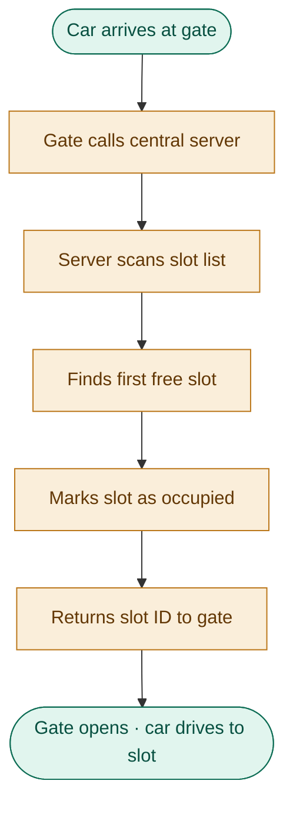
```mermaid
flowchart TD
    A([Car arrives at gate]) --> B[Gate calls central server]
    B --> C[Server scans slot list]
    C --> D[Finds first free slot]
    D --> E[Marks slot as occupied]
    E --> F[Returns slot ID to gate]
    F --> G([Gate opens · car drives to slot])

    style A fill:#e1f5ee,stroke:#0f6e56,color:#085041
    style G fill:#e1f5ee,stroke:#0f6e56,color:#085041
    style B fill:#faeeda,stroke:#ba7517,color:#633806
    style C fill:#faeeda,stroke:#ba7517,color:#633806
    style D fill:#faeeda,stroke:#ba7517,color:#633806
    style E fill:#faeeda,stroke:#ba7517,color:#633806
    style F fill:#faeeda,stroke:#ba7517,color:#633806
```

This works fine for a small, quiet lot with one gate and twenty cars a day. But think about a large mall on a Sunday afternoon.

### 2.2 How It Breaks Under Load

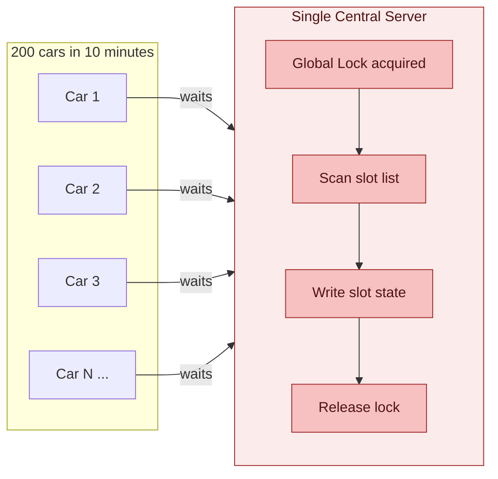
```mermaid
flowchart LR
    subgraph Cars ["200 cars in 10 minutes"]
        C1[Car 1]
        C2[Car 2]
        C3[Car 3]
        CN[Car N ...]
    end

    subgraph Bottleneck ["Single Central Server"]
        direction TB
        L[Global Lock acquired]
        S[Scan slot list]
        W[Write slot state]
        R[Release lock]
        L --> S --> W --> R
    end

    C1 -->|waits| Bottleneck
    C2 -->|waits| Bottleneck
    C3 -->|waits| Bottleneck
    CN -->|waits| Bottleneck

    style Bottleneck fill:#fcebeb,stroke:#a32d2d,color:#501313
    style L fill:#f7c1c1,stroke:#a32d2d,color:#501313
    style S fill:#f7c1c1,stroke:#a32d2d,color:#501313
    style W fill:#f7c1c1,stroke:#a32d2d,color:#501313
    style R fill:#f7c1c1,stroke:#a32d2d,color:#501313
```

**Failure Mode 1 — The central bottleneck.** Every car must talk to the server before the gate opens. The server processes requests one at a time. Cars queue up. Gates stay closed. The entrance road backs onto the street.

**Failure Mode 2 — Lock contention.** The server uses a lock so two cars don't get the same slot. While the lock is held for Car A, Cars B through N all wait — even if they would take completely different slots. Car A taking slot 42 and Car B taking slot 91 have zero conflict, yet they can't happen simultaneously.

**Failure Mode 3 — Single point of failure.** Server crashes → all gates freeze. The physical lot is perfectly fine; one piece of software kills everything.

**Failure Mode 4 — Ghost slots.** Server assigns slot 42 to Car A → Car A drives there → server crashes and restarts → server forgot about Car A → server assigns slot 42 to Car B → both cars arrive at the same slot. This is ghost occupancy: the software believes a slot is free when it is not.

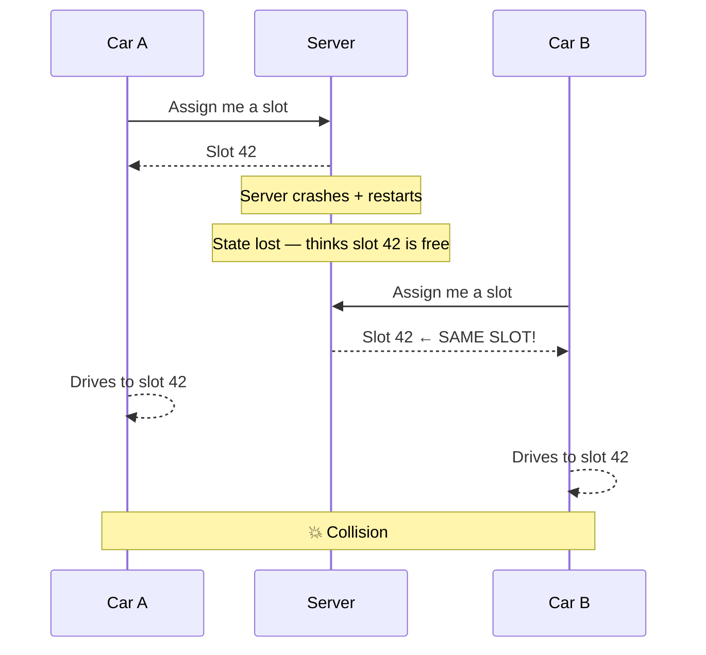
```mermaid
sequenceDiagram
    participant A as Car A
    participant S as Server
    participant B as Car B

    A->>S: Assign me a slot
    S-->>A: Slot 42
    Note over S: Server crashes + restarts
    Note over S: State lost — thinks slot 42 is free
    B->>S: Assign me a slot
    S-->>B: Slot 42 ← SAME SLOT!
    A-->>A: Drives to slot 42
    B-->>B: Drives to slot 42
    Note over A,B: 💥 Collision
```

---

## 3. Core Concepts You Must Understand

Before building the better system, you need three foundational ideas explained clearly.

### 3.1 What Is a Mutex?

A **mutex** (mutual exclusion) is a lock: only one thread can hold it at a time. Think of a bathroom with one key — you take the key, use the bathroom, return the key. While you have the key, nobody else can enter.

```
Thread A: acquire lock → read slot list → write slot 42 → release lock
                         [Thread B, C, D waiting the entire time]
Thread B: acquire lock → read slot list → write slot 18 → release lock
                         [Thread C, D still waiting]
```

This is safe but slow. At scale, threads spend more time waiting for the lock than doing work. Worse, the lock protects the entire slot list — Car A taking slot 42 and Car B taking slot 91 have no conflict, but the single mutex forces them to take turns anyway.

### 3.2 What Is an Atomic Operation?

An **atomic operation** completes entirely or not at all, with no intermediate state visible to anyone. The word comes from Greek *atomos* — indivisible.

Consider incrementing a counter. Non-atomically:
1. Read value (say, 5).
2. Add 1 → get 6.
3. Write 6 back.

If two threads do this simultaneously, both might read 5, both compute 6, both write 6 — the counter ends at 6 instead of 7. One increment was lost. This is a **race condition**.

An atomic increment does all three steps as one indivisible CPU operation.

### 3.3 What Is Compare-And-Swap (CAS)?

CAS is the most important atomic operation for our design:

```
CAS(memory_location, expected_value, new_value):
    if *memory_location == expected_value:
        *memory_location = new_value
        return SUCCESS   ← I updated it first
    else:
        return FAILURE   ← someone else changed it, retry
```

CAS says: "Only update this value if it still equals what I last read. If someone changed it in the meantime, tell me and I'll try again." This is the foundation of lock-free data structures.

### 3.4 What Is a Bitmap?

A **bitmap** is an array of bits where each bit represents the state of one item:

```
Slot positions:  7    6    5    4    3    2    1    0
Bitmap bits:     1    1    0    1    0    1    1    0

                 ↑                             ↑
               free                          taken

1 = slot is FREE
0 = slot is OCCUPIED
```

A floor with 64 slots fits in a single 64-bit integer (`uint64_t`). Checking if any slot is free — and reserving one — can be done in a single atomic CPU instruction. No database, no network call, no lock.

---

## 4. Lock-Free Bitmap Allocation

This is the heart of the entire design. Read it carefully.

### 4.1 The Data Structure

Each floor maintains one atomic 64-bit integer:

```
Floor A:   std::atomic<uint64_t> freeSlots;

Initial state (all 8 slots free, showing first 8 bits):
  Bit:    7   6   5   4   3   2   1   0
  Value:  1   1   1   1   1   1   1   1
          ↑                           ↑
        free                        free
```

### 4.2 The CAS Reservation Algorithm

When a car wants a slot, here is the exact sequence — no server, no lock, just CPU instructions:

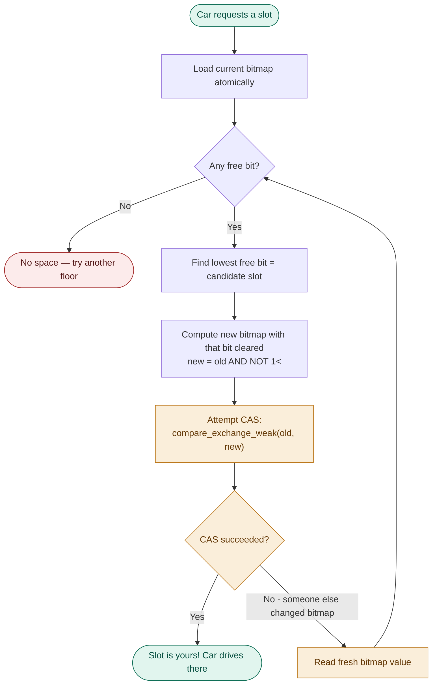
```mermaid
flowchart TD
    A([Car requests a slot]) --> B[Load current bitmap atomically]
    B --> C{Any free bit?}
    C -->|No| FULL([No space — try another floor])
    C -->|Yes| D[Find lowest free bit = candidate slot]
    D --> E["Compute new bitmap with that bit cleared\nnew = old AND NOT 1<<slot"]
    E --> F["Attempt CAS:\ncompare_exchange_weak(old, new)"]
    F --> G{CAS succeeded?}
    G -->|Yes| H([Slot is yours! Car drives there])
    G -->|No - someone else changed bitmap| I[Read fresh bitmap value]
    I --> C

    style A fill:#e1f5ee,stroke:#0f6e56,color:#085041
    style H fill:#e1f5ee,stroke:#0f6e56,color:#085041
    style FULL fill:#fcebeb,stroke:#a32d2d,color:#501313
    style F fill:#faeeda,stroke:#ba7517,color:#633806
    style G fill:#faeeda,stroke:#ba7517,color:#633806
    style I fill:#faeeda,stroke:#ba7517,color:#633806
```

### 4.3 Two Cars Arriving Simultaneously — Traced Step by Step

This is the critical scenario. Let's trace it exactly:

```
Initial bitmap:  1 1 1 0 1 1 1 1   (slots 0–2, 4–7 free; slot 3 taken)

Time T=0:
  Car A reads bitmap:  1 1 1 0 1 1 1 1 → finds slot 0 free → plans to clear bit 0
  Car B reads bitmap:  1 1 1 0 1 1 1 1 → finds slot 0 free → plans to clear bit 0
  (Both read the same snapshot simultaneously — conflict incoming)

Time T=1:
  Car A: CAS(old=11101111, new=11101110) → SUCCESS  ← A got slot 0
  Car B: CAS(old=11101111, new=11101110) → FAIL ← bitmap was changed by A

Time T=2 (Car B retries):
  Car B: reloads bitmap → 1 1 1 0 1 1 1 0 (slot 0 now taken by A)
  Car B: finds slot 1 free → CAS(old=11101110, new=11101100) → SUCCESS ← B got slot 1

Result: Car A → slot 0. Car B → slot 1. One retry. Zero locks. Microseconds.
```

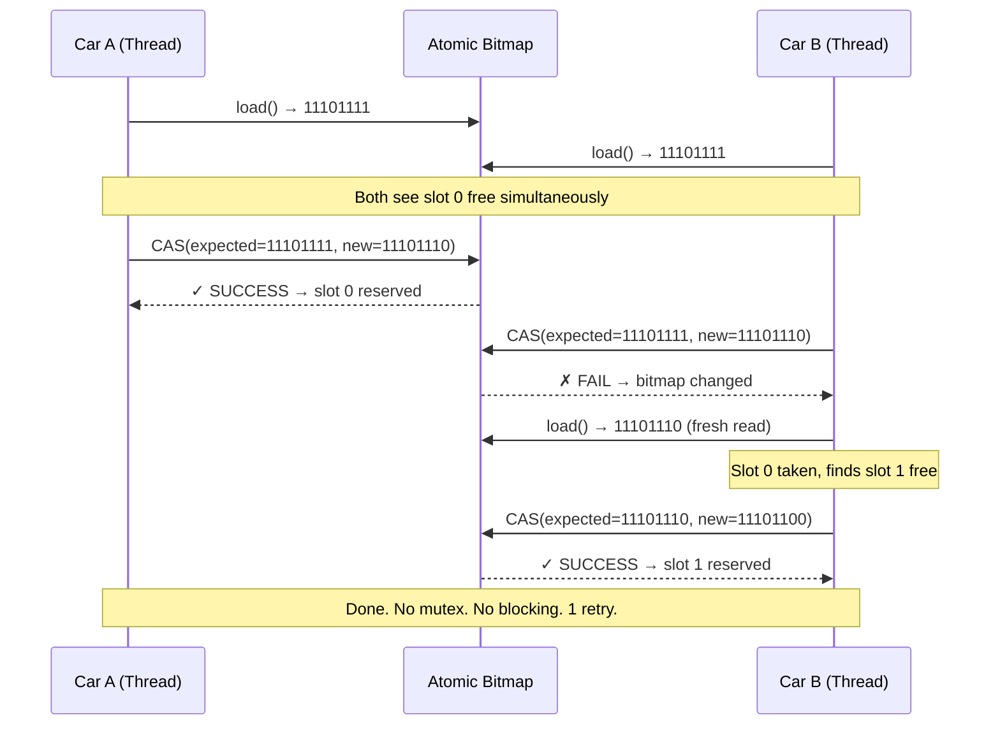
```mermaid
sequenceDiagram
    participant A as Car A (Thread)
    participant BM as Atomic Bitmap
    participant B as Car B (Thread)

    A->>BM: load() → 11101111
    B->>BM: load() → 11101111
    Note over A,B: Both see slot 0 free simultaneously
    A->>BM: CAS(expected=11101111, new=11101110)
    BM-->>A: ✓ SUCCESS → slot 0 reserved
    B->>BM: CAS(expected=11101111, new=11101110)
    BM-->>B: ✗ FAIL → bitmap changed
    B->>BM: load() → 11101110 (fresh read)
    Note over B: Slot 0 taken, finds slot 1 free
    B->>BM: CAS(expected=11101110, new=11101100)
    BM-->>B: ✓ SUCCESS → slot 1 reserved
    Note over A,B: Done. No mutex. No blocking. 1 retry.
```

### 4.4 Why This Is Powerful

Thousands of cars can simultaneously attempt parking with almost no contention because:
- Different slots are different bits in the bitmap.
- CAS conflicts only occur when two cars target the *exact same bit* at the *exact same nanosecond*.
- On conflict, the loser retries in microseconds, not milliseconds.
- There is no "waiting for a lock" — just occasional retries.

This is the same technique used inside `tcmalloc` (Google's memory allocator) and inside the Linux kernel's memory management. It works.

### 4.5 Hotspot Prevention with Randomized Probing

If every car always starts from bit 0, they all contend on the same bit even when slots 10–63 are completely free. The fix is simple: start probing from a random position.

```
function allocateSlot(bitmap):
    start = random(0, 63)
    for i in 0..63:
        slot = (start + i) % 64
        if bit[slot] is set (free):
            attempt CAS to clear this bit
            if success: return slot
    return NO_SLOT_AVAILABLE
```

Car A starts at bit 37, Car B starts at bit 12, Car C starts at bit 55 — they spread across the bitmap naturally. CAS conflicts become rare even under hundreds of simultaneous arrivals.

---

## 5. Slot State Machine

Every individual slot transitions through exactly four states. Understanding these transitions is what prevents ghost slots and ensures billing accuracy.

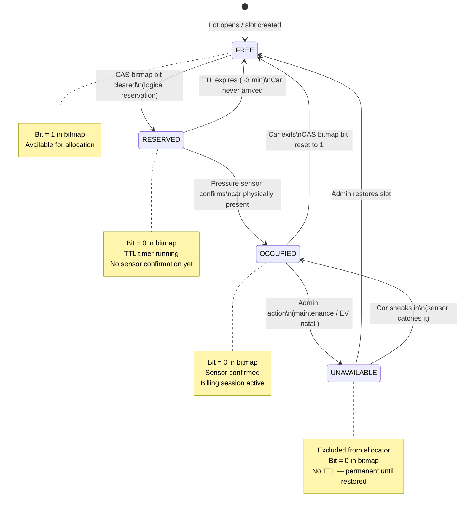
```mermaid
stateDiagram-v2
    [*] --> FREE : Lot opens / slot created

    FREE --> RESERVED : CAS bitmap bit cleared\n(logical reservation)
    RESERVED --> FREE : TTL expires (~3 min)\nCar never arrived
    RESERVED --> OCCUPIED : Pressure sensor confirms\ncar physically present
    OCCUPIED --> FREE : Car exits\nCAS bitmap bit reset to 1
    OCCUPIED --> UNAVAILABLE : Admin action\n(maintenance / EV install)
    UNAVAILABLE --> FREE : Admin restores slot
    UNAVAILABLE --> OCCUPIED : Car sneaks in\n(sensor catches it)

    note right of FREE
        Bit = 1 in bitmap
        Available for allocation
    end note

    note right of RESERVED
        Bit = 0 in bitmap
        TTL timer running
        No sensor confirmation yet
    end note

    note right of OCCUPIED
        Bit = 0 in bitmap
        Sensor confirmed
        Billing session active
    end note

    note right of UNAVAILABLE
        Excluded from allocator
        Bit = 0 in bitmap
        No TTL — permanent until restored
    end note
```

### 5.1 Why Two Phases Matter

The transition from RESERVED to OCCUPIED is the "two-phase commit" of parking:

**Phase 1 — Logical reservation (RESERVED):** The bitmap bit is cleared atomically via CAS. No physical confirmation yet. This happens in microseconds. A TTL (typically 2–5 minutes) is attached — if the car doesn't show up, the slot automatically reverts to FREE.

**Phase 2 — Physical confirmation (OCCUPIED):** A pressure sensor, infrared beam, or camera detects the car. Only now is the session committed to the billing system. The TTL is removed because the car is actually there.

This two-phase design solves the ghost slot problem entirely. Even if your server crashes between Phase 1 and Phase 2, the TTL ensures the slot eventually frees itself. There are no permanent "ghost reservations."

### 5.2 Slot State Storage

The bitmap handles FREE vs NOT-FREE at CPU speed. Richer state (who reserved it, when, TTL) lives separately:

```json
{
  "slot_42": {
    "state": "RESERVED",
    "reservation_id": "uuid-abc-123",
    "reserved_by": "KA01AB1234",
    "reserved_at": 1716534210,
    "ttl_expires_at": 1716534390,
    "slot_type": "STANDARD"
  }
}
```

The bitmap is the fast path (single CPU instruction). The state store is the slow path (for TTL management, billing, sensor confirmation). They complement each other.

---

## 6. Zone-Based Architecture

### 6.1 Why Zones?

A single `uint64_t` bitmap handles 64 slots. A large mall might have 3000 slots across six floors. More importantly, even if you chain multiple bitmaps together, one allocator for the whole lot is still a logical bottleneck — a single process that all gates must reach.

The answer is zone decomposition: split the lot into independent sub-lots (zones), each managing its own resources.

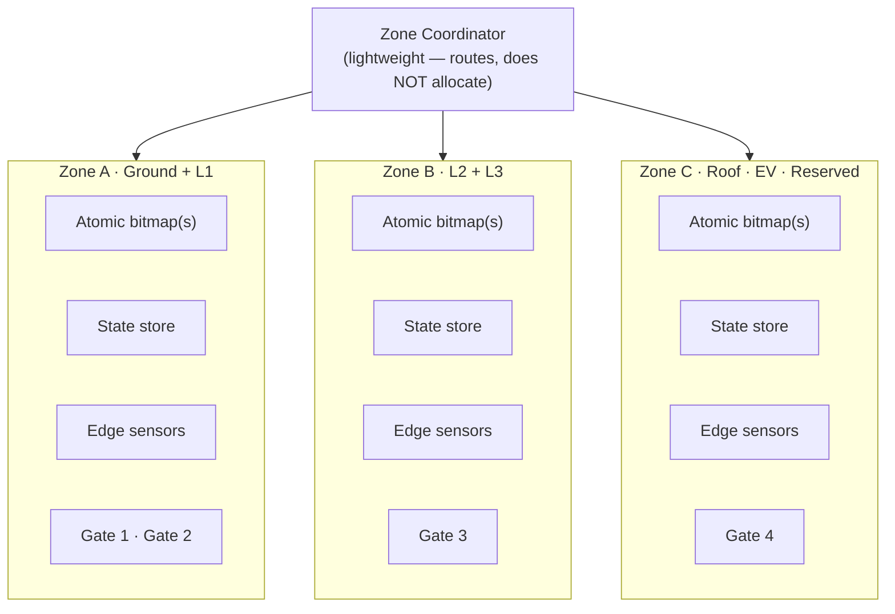
```mermaid
graph TD
    ZC["Zone Coordinator\n(lightweight — routes, does NOT allocate)"]

    subgraph ZoneA["Zone A · Ground + L1"]
        BA["Atomic bitmap(s)"]
        SA["State store"]
        EA["Edge sensors"]
        GA["Gate 1 · Gate 2"]
    end

    subgraph ZoneB["Zone B · L2 + L3"]
        BB["Atomic bitmap(s)"]
        SB["State store"]
        EB["Edge sensors"]
        GB["Gate 3"]
    end

    subgraph ZoneC["Zone C · Roof · EV · Reserved"]
        BC["Atomic bitmap(s)"]
        SC["State store"]
        EC["Edge sensors"]
        GC["Gate 4"]
    end

    ZC --> ZoneA
    ZC --> ZoneB
    ZC --> ZoneC
```

### 6.2 What the Zone Coordinator Does and Does NOT Do

The Zone Coordinator is deliberately lightweight. It must never become a bottleneck.

**It DOES:**
- Maintain approximate free-slot counts per zone (pushed by zones every few seconds, not per-allocation).
- Route incoming cars to the least-congested zone before they enter.
- Provide zone-level availability for apps ("Zone B has ~45 free spots").
- Handle cross-zone transfer reservations (rare edge case).

**It does NOT:**
- Handle individual slot assignments (each zone does this locally via CAS on its own bitmap).
- Hold a lock that all zones must acquire.
- Process transactions.

The zone count is **approximate and eventually consistent** — zones push updates every few seconds. The coordinator might say "Zone A has 30 free" when it actually has 28 or 32. That's fine. Its job is to give cars a *direction to drive*, not an exact count. The actual slot reservation happens locally with exact atomic guarantees.

This is exactly analogous to database sharding: instead of one giant table with a global lock, you split into shards that each manage their own data independently.

### 6.3 Zone Isolation Means Fault Tolerance

If Zone B's allocator crashes, Zones A and C keep working. Cars are simply routed away from Zone B. This is a dramatic improvement over the centralized design where a single server crash stops every gate.

---

## 7. One-Way Traffic and Physical Deadlock Prevention

### 7.1 What Is a Physical Deadlock?

In narrow parking lot lanes, two cars can face each other head-on with no room to pass:

```
        ← Car B driving this way

   [Car B] 🚗                    🚗 [Car A]

                 Car A driving this way →

Both trying to occupy the same narrow lane from opposite ends.
Neither can move forward. Neither can easily reverse.
This is a physical deadlock.
```

Unlike software deadlocks (which you can kill and restart), physical deadlocks require human intervention. Your design should make them *impossible*, not merely handle them.

### 7.2 The Directed Lane Graph

The most elegant solution: model all lanes as a **directed graph** where edges are one-directional. Cars can only traverse a lane in one specific direction.

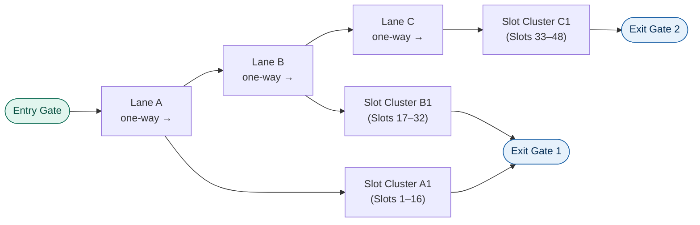
```mermaid
flowchart LR
    ENTRY([Entry Gate]) --> LA[Lane A\none-way →]
    LA --> LB[Lane B\none-way →]
    LB --> LC[Lane C\none-way →]

    LA --> SA["Slot Cluster A1\n(Slots 1–16)"]
    LB --> SB["Slot Cluster B1\n(Slots 17–32)"]
    LC --> SC["Slot Cluster C1\n(Slots 33–48)"]

    SA --> EXIT1
    SB --> EXIT1
    SC --> EXIT2

    EXIT1([Exit Gate 1])
    EXIT2([Exit Gate 2])

    style ENTRY fill:#e1f5ee,stroke:#0f6e56,color:#085041
    style EXIT1 fill:#e6f1fb,stroke:#185fa5,color:#042c53
    style EXIT2 fill:#e6f1fb,stroke:#185fa5,color:#042c53
```

With a directed graph, cycles are impossible — and deadlocks require cycles. No cycles → no head-on collisions by design.

### 7.3 Lane Segment Leases (Edge Coordination)

For precision control (and autonomous vehicle scenarios), each lane segment can issue **micro-leases** — short-lived locks on a segment of lane. Think of it like railway track sections: a train can only enter a section if that section is clear.

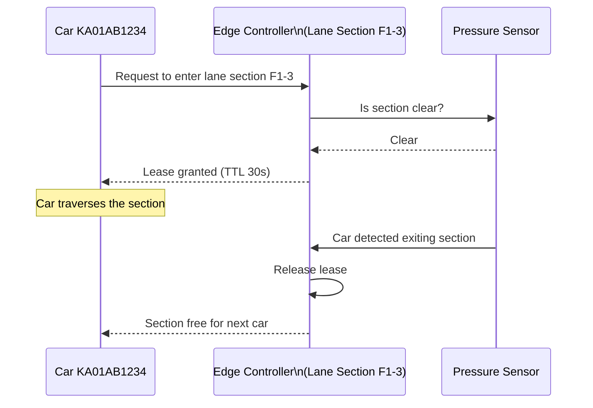
```mermaid
sequenceDiagram
    participant Car as Car KA01AB1234
    participant EC as Edge Controller\n(Lane Section F1-3)
    participant Sensor as Pressure Sensor

    Car->>EC: Request to enter lane section F1-3
    EC->>Sensor: Is section clear?
    Sensor-->>EC: Clear
    EC-->>Car: Lease granted (TTL 30s)
    Note over Car: Car traverses the section
    Sensor->>EC: Car detected exiting section
    EC->>EC: Release lease
    EC-->>Car: Section free for next car
```

Edge controllers operate locally — they don't contact a central server to issue or release leases. This keeps lane management fast and decentralized. Each edge controller has a camera, pressure plate, and RFID reader. If the TTL expires (car broke down, sensor malfunction), the lease auto-releases.

---

## 8. End-to-End Car Flow

### 8.1 Complete Sequence — From Home to Parked

This is the full journey of a single car through the designed system:

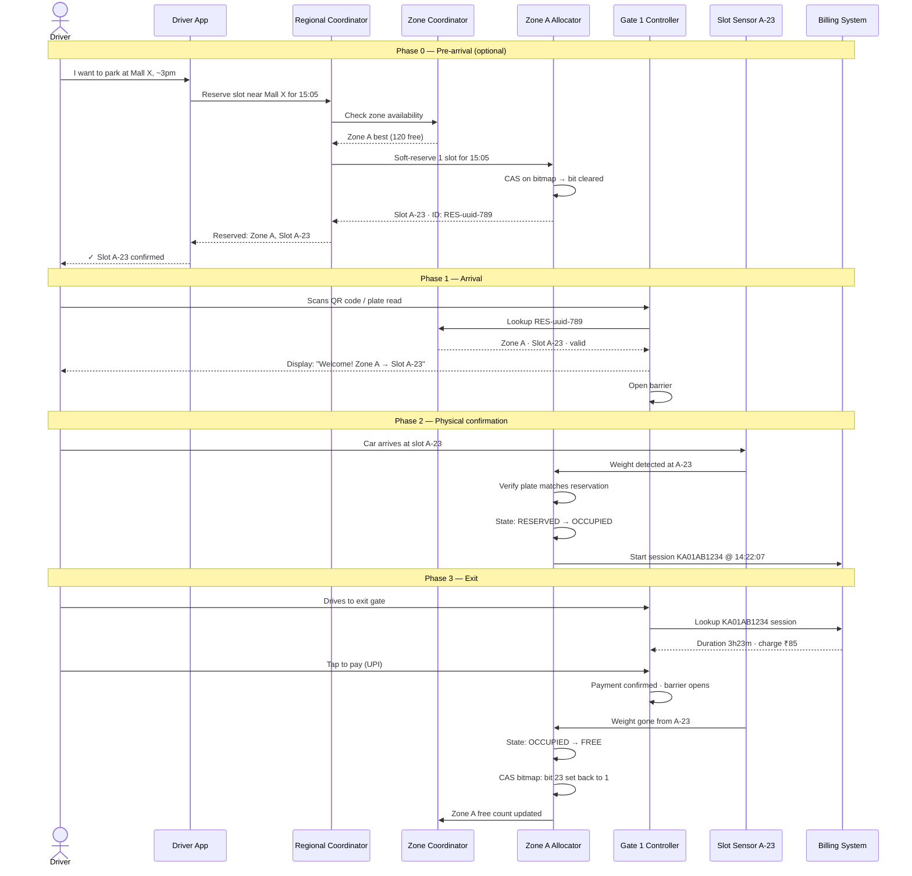
```mermaid
sequenceDiagram
    actor Driver
    participant App as Driver App
    participant RC as Regional Coordinator
    participant ZC as Zone Coordinator
    participant ZA as Zone A Allocator
    participant Gate as Gate 1 Controller
    participant Sensor as Slot Sensor A-23
    participant Billing as Billing System

    Note over Driver,Billing: Phase 0 — Pre-arrival (optional)
    Driver->>App: I want to park at Mall X, ~3pm
    App->>RC: Reserve slot near Mall X for 15:05
    RC->>ZC: Check zone availability
    ZC-->>RC: Zone A best (120 free)
    RC->>ZA: Soft-reserve 1 slot for 15:05
    ZA->>ZA: CAS on bitmap → bit cleared
    ZA-->>RC: Slot A-23 · ID: RES-uuid-789
    RC-->>App: Reserved: Zone A, Slot A-23
    App-->>Driver: ✓ Slot A-23 confirmed

    Note over Driver,Billing: Phase 1 — Arrival
    Driver->>Gate: Scans QR code / plate read
    Gate->>ZC: Lookup RES-uuid-789
    ZC-->>Gate: Zone A · Slot A-23 · valid
    Gate-->>Driver: Display: "Welcome! Zone A → Slot A-23"
    Gate->>Gate: Open barrier

    Note over Driver,Billing: Phase 2 — Physical confirmation
    Driver->>Sensor: Car arrives at slot A-23
    Sensor->>ZA: Weight detected at A-23
    ZA->>ZA: Verify plate matches reservation
    ZA->>ZA: State: RESERVED → OCCUPIED
    ZA->>Billing: Start session KA01AB1234 @ 14:22:07

    Note over Driver,Billing: Phase 3 — Exit
    Driver->>Gate: Drives to exit gate
    Gate->>Billing: Lookup KA01AB1234 session
    Billing-->>Gate: Duration 3h23m · charge ₹85
    Driver->>Gate: Tap to pay (UPI)
    Gate->>Gate: Payment confirmed · barrier opens
    Sensor->>ZA: Weight gone from A-23
    ZA->>ZA: State: OCCUPIED → FREE
    ZA->>ZA: CAS bitmap: bit 23 set back to 1
    ZA->>ZC: Zone A free count updated
```

### 8.2 Walk-In Car (No Prior Reservation)

The same system handles walk-ins — the pre-arrival phase simply collapses into gate entry:

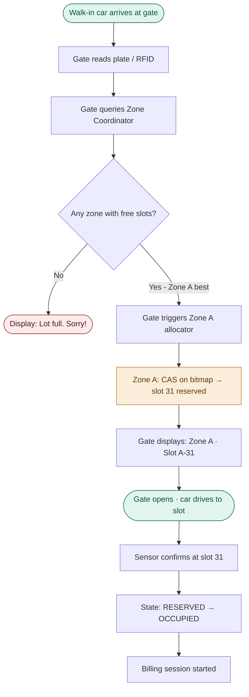
```mermaid
flowchart TD
    A([Walk-in car arrives at gate]) --> B[Gate reads plate / RFID]
    B --> C[Gate queries Zone Coordinator]
    C --> D{Any zone with free slots?}
    D -->|No| FULL([Display: Lot full. Sorry!])
    D -->|Yes - Zone A best| E[Gate triggers Zone A allocator]
    E --> F[Zone A: CAS on bitmap → slot 31 reserved]
    F --> G[Gate displays: Zone A · Slot A-31]
    G --> H([Gate opens · car drives to slot])
    H --> I[Sensor confirms at slot 31]
    I --> J[State: RESERVED → OCCUPIED]
    J --> K[Billing session started]

    style A fill:#e1f5ee,stroke:#0f6e56,color:#085041
    style H fill:#e1f5ee,stroke:#0f6e56,color:#085041
    style FULL fill:#fcebeb,stroke:#a32d2d,color:#501313
    style F fill:#faeeda,stroke:#ba7517,color:#633806
```

---

## 9. Edge Cases and Failure Handling

### 9.1 Server Crash Mid-Reservation

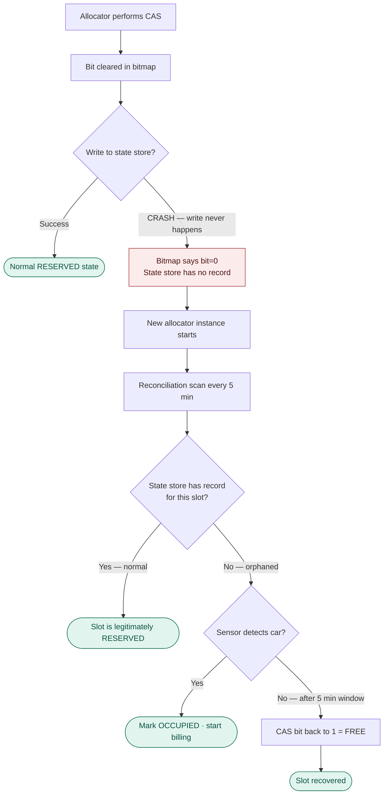
```mermaid
flowchart TD
    A[Allocator performs CAS] --> B[Bit cleared in bitmap]
    B --> C{Write to state store?}
    C -->|Success| D([Normal RESERVED state])
    C -->|CRASH — write never happens| E[Bitmap says bit=0\nState store has no record]

    E --> F[New allocator instance starts]
    F --> G[Reconciliation scan every 5 min]
    G --> H{State store has record\nfor this slot?}
    H -->|Yes — normal| I([Slot is legitimately RESERVED])
    H -->|No — orphaned| J{Sensor detects car?}
    J -->|Yes| K([Mark OCCUPIED · start billing])
    J -->|No — after 5 min window| L[CAS bit back to 1 = FREE]
    L --> M([Slot recovered])

    style D fill:#e1f5ee,stroke:#0f6e56,color:#085041
    style I fill:#e1f5ee,stroke:#0f6e56,color:#085041
    style K fill:#e1f5ee,stroke:#0f6e56,color:#085041
    style M fill:#e1f5ee,stroke:#0f6e56,color:#085041
    style E fill:#fcebeb,stroke:#a32d2d,color:#501313
```

**Idempotency** ensures safe retries. Every reservation gets a UUID (`RES-uuid-789`). If the client retries after a timeout, the allocator recognizes "I've already processed this UUID" and returns the same slot without double-allocating.

### 9.2 Car Parks in Wrong Slot

This happens more often than you'd think. Driver assigned A-23, parks in A-31 by mistake.

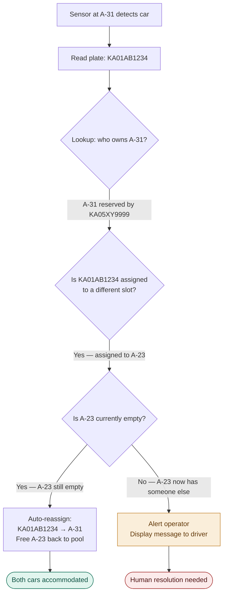
```mermaid
flowchart TD
    S[Sensor at A-31 detects car] --> R[Read plate: KA01AB1234]
    R --> L{Lookup: who owns A-31?}
    L -->|A-31 reserved by KA05XY9999| M{Is KA01AB1234 assigned\nto a different slot?}
    M -->|Yes — assigned to A-23| N{Is A-23 currently empty?}
    N -->|Yes — A-23 still empty| AUTO[Auto-reassign:\nKA01AB1234 → A-31\nFree A-23 back to pool]
    N -->|No — A-23 now has someone else| ALERT[Alert operator\nDisplay message to driver]
    AUTO --> OK([Both cars accommodated])
    ALERT --> HUMAN([Human resolution needed])

    style OK fill:#e1f5ee,stroke:#0f6e56,color:#085041
    style ALERT fill:#faeeda,stroke:#ba7517,color:#633806
    style HUMAN fill:#fcebeb,stroke:#a32d2d,color:#501313
```

### 9.3 TTL Expiry and Slot Recovery

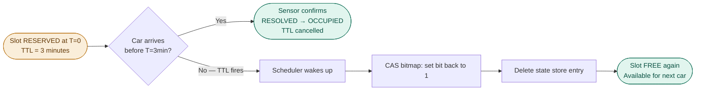
```mermaid
flowchart LR
    A([Slot RESERVED at T=0\nTTL = 3 minutes]) --> B{Car arrives\nbefore T=3min?}
    B -->|Yes| C([Sensor confirms\nRESOLVED → OCCUPIED\nTTL cancelled])
    B -->|No — TTL fires| D[Scheduler wakes up]
    D --> E[CAS bitmap: set bit back to 1]
    E --> F[Delete state store entry]
    F --> G([Slot FREE again\nAvailable for next car])

    style A fill:#faeeda,stroke:#ba7517,color:#633806
    style C fill:#e1f5ee,stroke:#0f6e56,color:#085041
    style G fill:#e1f5ee,stroke:#0f6e56,color:#085041
```

---

## 10. Phases of Scale

A well-designed system doesn't start at "city-wide distributed network." It grows through motivated phases.

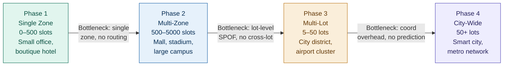
```mermaid
graph LR
    P1["Phase 1\nSingle Zone\n0–500 slots\nSmall office,\nboutique hotel"]
    P2["Phase 2\nMulti-Zone\n500–5000 slots\nMall, stadium,\nlarge campus"]
    P3["Phase 3\nMulti-Lot\n5–50 lots\nCity district,\nairport cluster"]
    P4["Phase 4\nCity-Wide\n50+ lots\nSmart city,\nmetro network"]

    P1 -->|Bottleneck: single\nzone, no routing| P2
    P2 -->|Bottleneck: lot-level\nSPOF, no cross-lot| P3
    P3 -->|Bottleneck: coord\noverhead, no prediction| P4

    style P1 fill:#e1f5ee,stroke:#0f6e56,color:#085041
    style P2 fill:#e6f1fb,stroke:#185fa5,color:#042c53
    style P3 fill:#faeeda,stroke:#ba7517,color:#633806
    style P4 fill:#eeedfe,stroke:#534ab7,color:#26215c
```

### Phase 1: Single Lot, Single Zone (0 – 500 slots)

**What you build:** One zone, one atomic bitmap per floor, a Redis-backed state store, simple gate controllers with RFID or QR code entry, manual sensor integration.

**Architecture:**
```
Gate → Zone Allocator (1 process) → Atomic Bitmap (per floor)
                                  → State Store (Redis)
                                  → Slot Sensors
```

**Appropriate for:** Small office building, boutique hotel, neighborhood shopping complex.

**The single biggest improvement over naive:** Replacing the global mutex with CAS on a bitmap. This alone gives you from ~20 cars/min to hundreds.

### Phase 2: Single Lot, Multiple Zones (500 – 5,000 slots)

**What you add:** 3–5 zones, a lightweight Zone Coordinator, dynamic LED signage at entry, a mobile app for pre-reservations, TTL-based soft holds.

**Architecture:**
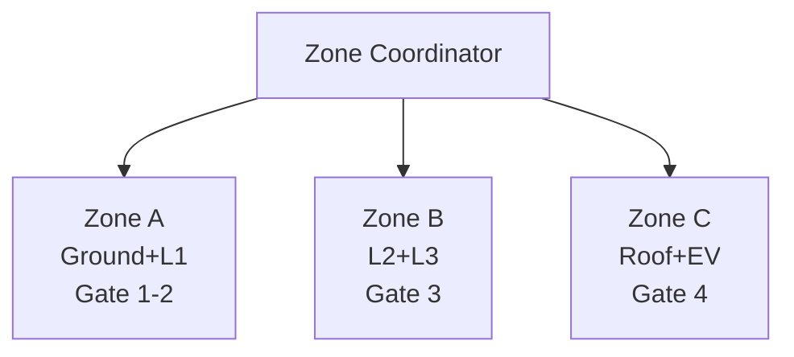
```mermaid
graph TD
    ZC[Zone Coordinator]
    ZC --> ZA[Zone A\nGround+L1\nGate 1-2]
    ZC --> ZB[Zone B\nL2+L3\nGate 3]
    ZC --> ZC2[Zone C\nRoof+EV\nGate 4]
```

**Key benefit:** Zone-level failure isolation. Zone B's allocator can crash without affecting A and C.

### Phase 3: Multi-Lot, District Scale (5 – 50 lots)

**What you add:** Each lot becomes an independent distributed node with its own coordinator. A Regional Coordinator aggregates availability across lots. City-level app integration. Navigation app APIs (Google Maps, Waze). Event routing ("Stadium event in 2 hours — pre-fill nearby lots"). Island-mode fallback (lot operates locally if regional coordinator is unreachable).

**Architecture:**
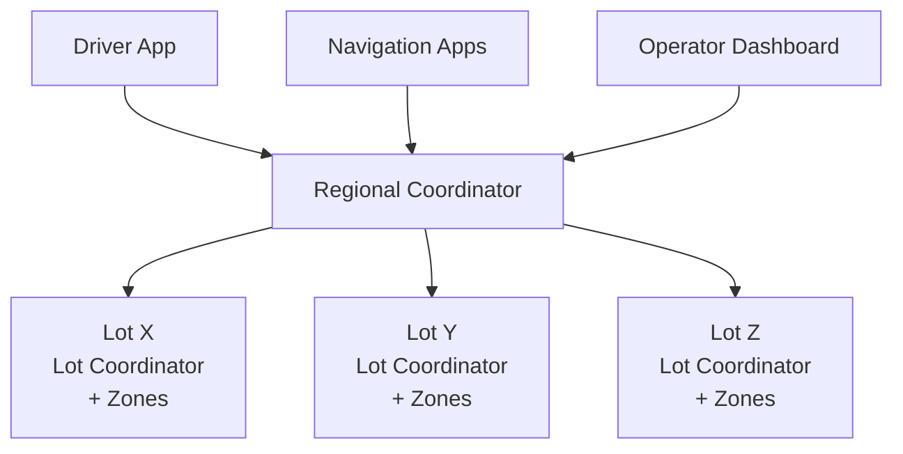
```mermaid
graph TD
    RC[Regional Coordinator]
    RC --> LotX[Lot X\nLot Coordinator\n+ Zones]
    RC --> LotY[Lot Y\nLot Coordinator\n+ Zones]
    RC --> LotZ[Lot Z\nLot Coordinator\n+ Zones]

    APP[Driver App] --> RC
    NAV[Navigation Apps] --> RC
    DASH[Operator Dashboard] --> RC
```

**New challenge:** The regional coordinator displays counts that are always 5–10 seconds stale. That is acceptable for directional routing but not for actual slot reservation. Those are different concerns handled at different layers.

### Phase 4: City-Wide Infrastructure (50+ lots)

**What you add:**
- **Predictive allocation:** ML model pre-reserves slot clusters before demand arrives, based on time-of-day, events, weather, and historical patterns.
- **Dynamic pricing:** Slots priced on real-time demand (like Uber surge pricing).
- **CRDT occupancy maps:** City-wide dashboards without coordination overhead. Each zone updates its own counter independently; totals converge without any node needing to "agree."
- **Kafka event streams:** Every slot state change emits an event. Billing, analytics, city traffic management all subscribe independently.
- **Autonomous vehicle integration:** AVs communicate directly with the parking system to negotiate slots and navigation paths without human involvement.

**What is a CRDT?** A Conflict-free Replicated Data Type is a data structure designed to be updated on multiple nodes without coordination — nodes update independently and their states eventually converge to the same value. For a parking total-count dashboard, this is perfect: each zone increments/decrements its own counter, and the city-wide total is a sum. No locking, no consensus round-trips.

---

## 11. Full High-Level Architecture

This is the complete system at Phase 3 — the level most appropriate for a senior engineering interview.

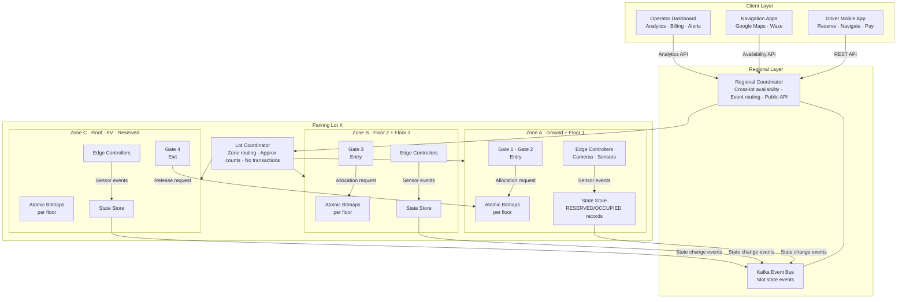
```mermaid
graph TB
    subgraph Client["Client Layer"]
        APP[Driver Mobile App\nReserve · Navigate · Pay]
        NAV[Navigation Apps\nGoogle Maps · Waze]
        DASH[Operator Dashboard\nAnalytics · Billing · Alerts]
    end

    subgraph Regional["Regional Layer"]
        RC[Regional Coordinator\nCross-lot availability · Event routing · Public API]
        KAFKA[Kafka Event Bus\nSlot state events]
    end

    subgraph Lot["Parking Lot X"]
        LC[Lot Coordinator\nZone routing · Approx counts · No transactions]

        subgraph ZA["Zone A · Ground + Floor 1"]
            BA[Atomic Bitmaps\nper floor]
            SSA[State Store\nRESERVED/OCCUPIED records]
            ECA[Edge Controllers\nCameras · Sensors]
            G12[Gate 1 · Gate 2\nEntry]
        end

        subgraph ZB["Zone B · Floor 2 + Floor 3"]
            BB[Atomic Bitmaps\nper floor]
            SSB[State Store]
            ECB[Edge Controllers]
            G3[Gate 3\nEntry]
        end

        subgraph ZC["Zone C · Roof · EV · Reserved"]
            BC[Atomic Bitmaps\nper floor]
            SSC[State Store]
            ECC[Edge Controllers]
            G4[Gate 4\nExit]
        end
    end

    APP -->|REST API| RC
    NAV -->|Availability API| RC
    DASH -->|Analytics API| RC

    RC --> LC
    RC --- KAFKA

    LC --> ZA
    LC --> ZB
    LC --> ZC

    G12 -->|Allocation request| BA
    G3  -->|Allocation request| BB
    G4  -->|Release request| BA

    ECA -->|Sensor events| SSA
    ECB -->|Sensor events| SSB
    ECC -->|Sensor events| SSC

    SSA -->|State change events| KAFKA
    SSB -->|State change events| KAFKA
    SSC -->|State change events| KAFKA
```

### Data Flow Summary

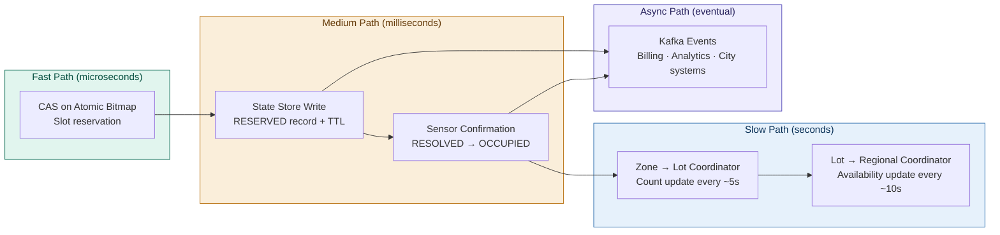
```mermaid
flowchart LR
    subgraph Fast["Fast Path (microseconds)"]
        CAS[CAS on Atomic Bitmap\nSlot reservation]
    end

    subgraph Medium["Medium Path (milliseconds)"]
        STATE[State Store Write\nRESERVED record + TTL]
        SENSOR[Sensor Confirmation\nRESOLVED → OCCUPIED]
    end

    subgraph Slow["Slow Path (seconds)"]
        ZONE[Zone → Lot Coordinator\nCount update every ~5s]
        LOT[Lot → Regional Coordinator\nAvailability update every ~10s]
    end

    subgraph Async["Async Path (eventual)"]
        KAFKA2[Kafka Events\nBilling · Analytics · City systems]
    end

    CAS --> STATE
    STATE --> SENSOR
    SENSOR --> ZONE
    ZONE --> LOT
    STATE --> KAFKA2
    SENSOR --> KAFKA2

    style Fast fill:#e1f5ee,stroke:#0f6e56,color:#085041
    style Medium fill:#faeeda,stroke:#ba7517,color:#633806
    style Slow fill:#e6f1fb,stroke:#185fa5,color:#042c53
    style Async fill:#eeedfe,stroke:#534ab7,color:#26215c
```

---

## 12. Concurrency Summary Table

| Layer | Mechanism | Guarantee | Speed |
|---|---|---|---|
| Individual slot reservation | Atomic CAS on bitmap | Exactly one car per slot, no locks | Microseconds |
| Cross-slot isolation | Per-zone bitmaps | Cars wanting different slots never contend | Microseconds |
| Ghost slot prevention | TTL on RESERVED state | Unconfirmed reservations auto-expire | Minutes |
| Physical confirmation | Sensor → two-phase commit | OCCUPIED only after car physically present | Seconds |
| Lane movement safety | Directed graph + edge leases | Physical deadlock impossible by topology | Real-time |
| Zone-level routing | Eventually consistent counts | Fast routing, acceptable staleness | ~5 seconds |
| Failure recovery | Idempotent UUIDs + reconciliation | Safe retries, no double-allocation | Minutes |
| Cross-lot coordination | Regional coordinator (read-heavy) | Availability routing, not transaction processing | ~10 seconds |
| City-wide analytics | Kafka + CRDT aggregates | Scalable, coordination-free pipelines | Eventual |

---

## 13. Interview Strategy

### The Opening — First 60 Seconds

Do NOT start with `class ParkingLot`. Do NOT start with a UML diagram. Start here:

> "Before I define any classes or APIs, I want to establish the core framing: a parking lot is fundamentally a concurrent resource allocation system with physical movement constraints. That framing changes everything about how we design it."

Immediately surface the three core problems: efficient slot discovery, collision-free allocation, and movement deadlock prevention.

### The Decision Tree for Slot Allocation

When asked "how does concurrent reservation work?":

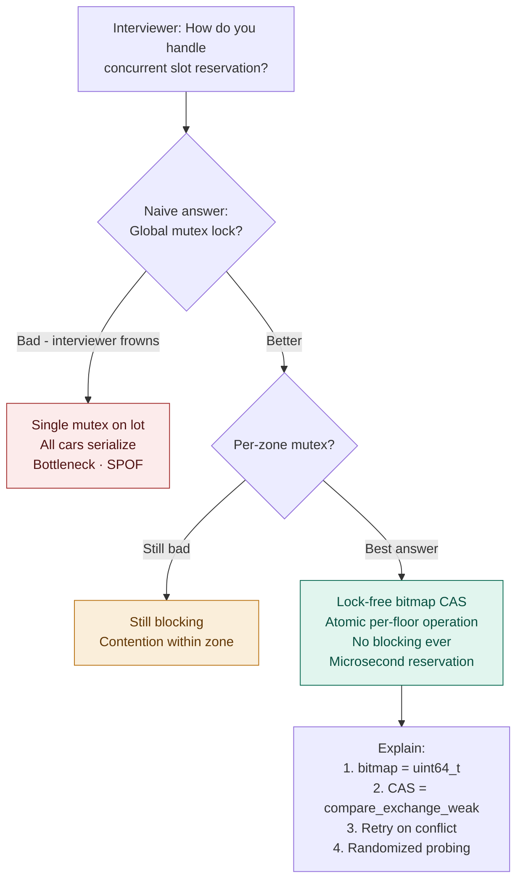
```mermaid
flowchart TD
    Q[Interviewer: How do you handle\nconcurrent slot reservation?] --> A

    A{Naive answer:\nGlobal mutex lock?} -->|Bad - interviewer frowns| MUTEX[Single mutex on lot\nAll cars serialize\nBottleneck · SPOF]

    A -->|Better| B{Per-zone mutex?}
    B -->|Still bad| ZMUTEX[Still blocking\nContention within zone]

    B -->|Best answer| BITMAP[Lock-free bitmap CAS\nAtomic per-floor operation\nNo blocking ever\nMicrosecond reservation]

    BITMAP --> EXPLAIN[Explain:\n1. bitmap = uint64_t\n2. CAS = compare_exchange_weak\n3. Retry on conflict\n4. Randomized probing]

    style MUTEX fill:#fcebeb,stroke:#a32d2d,color:#501313
    style ZMUTEX fill:#faeeda,stroke:#ba7517,color:#633806
    style BITMAP fill:#e1f5ee,stroke:#0f6e56,color:#085041
```

### The Gold Statement

When the interviewer asks about locking strategy, say:

> "I would avoid pessimistic locking because parking allocation is a high-concurrency, low-conflict problem. Optimistic atomic reservation with localized contention domains scales far better."

### The Closing Statement

End with:

> "The real challenge in parking lot design isn't object modeling — it's building a low-contention concurrent resource allocator that also respects physical movement constraints. Standard OOP decomposition handles neither of those well."

---

## 14. Quick Reference Glossary

| Concept | Simple Explanation |
|---|---|
| **Mutex** | A lock only one thread can hold at a time. Safe but terrible at scale. |
| **Atomic CAS** | CPU instruction: update a value only if it still matches what you last read; otherwise fail and retry. Foundation of lock-free code. |
| **Lock-free bitmap** | A 64-bit integer where each bit = one slot's availability. CAS on this integer = lock-free slot reservation in one CPU instruction. |
| **Two-phase allocation** | Phase 1: logical reservation (CAS bitmap). Phase 2: physical confirmation (sensor). Prevents ghost slots. |
| **TTL (Time-To-Live)** | A timeout on soft state. Reservations not confirmed within TTL auto-expire. Eliminates ghost reservations permanently. |
| **Zone sharding** | Split the lot into independent zones, each managing its own allocation. Directly analogous to database sharding. |
| **Directed graph** | Lane network where every edge has one direction. Eliminates cyclic paths. Deadlock requires cycles. No cycles → no deadlock. |
| **Edge controller** | Small computer at each lane segment. Issues micro-leases. Operates without contacting a central server. |
| **Idempotency** | Same operation applied multiple times produces the same result. Enables safe retries after failures. No double-allocations. |
| **Hotspot** | A resource that many threads contend on simultaneously. Randomized bit probing spreads contention across the bitmap. |
| **CRDT** | Data structure that can be updated independently on multiple nodes and eventually converges without coordination. Used for city-wide counts. |
| **Eventual consistency** | Different nodes may temporarily disagree on values but converge given no new updates. Acceptable for routing; never for reservations. |
| **Island-mode** | A lot operating locally without reaching the regional coordinator. Accepts cars based on local bitmap state alone. |
| **Ghost occupancy** | Software believes a slot is free when a car is physically there (or vice versa). Prevented by sensor-based two-phase confirmation. |
| **Optimistic concurrency** | Assume no conflict, attempt the operation, retry only if a conflict actually occurred. Wins over pessimistic locking in low-conflict environments. |

---

*This chapter covers the parking lot problem at the level expected of senior engineers — not as an exercise in object-oriented modeling, but as a practical lesson in concurrent resource allocation, distributed coordination, and scalable system architecture. The same patterns appear in memory allocators, database connection pools, distributed lock managers, and real-time inventory systems. Master the parking lot, and you've mastered a dozen other problems.*
