# 🔥 Amazon SDE-3 System Design: The Hot Partition Problem
### *How 3 Tenants Silently Destroyed 50,000 Others — And How to Fix It*

---

> **The Question (verbatim):**
> *"Your datastore has 50,000 tenants shared across 64 partitions. 3 tenants spike to 8,000 writes per second, and two of them land on the same partition. p50 is still 18ms. Your alerts are silent. p99 just went from 40ms to 2.3 seconds. Retries doubled the write load on an already dying shard. 800 quiet tenants sharing that partition are now timed out. 3 tenants broke the experience for 50,000 others and your monitoring missed it entirely. What false assumption in your sharding design made this possible, and how do you fix it without rehashing everything or breaking correctness under retries?"*

---

## Table of Contents

1. [System Architecture: Before the Incident](#1-system-architecture-before-the-incident)
2. [The False Assumptions](#2-the-false-assumptions)
3. [The Failure Cascade: What Actually Happened, Step by Step](#3-the-failure-cascade-step-by-step)
4. [Why Your Monitoring Missed It](#4-why-your-monitoring-missed-it)
5. [Problems with the Current Implementation](#5-problems-with-the-current-implementation)
6. [The Fix: Surgical Remediation Without a Full Rehash](#6-the-fix)
7. [How Real Companies Solved This](#7-how-real-companies-solved-this)
8. [Bottlenecks Resolved: Summary Matrix](#8-bottlenecks-resolved)
9. [The Closing Statement (For the Interview)](#9-closing-statement)

---

## 1. System Architecture: Before the Incident

This is what the system looks like during normal operation — 50,000 tenants mapped to 64 partitions via simple consistent hashing on `tenant_id`.

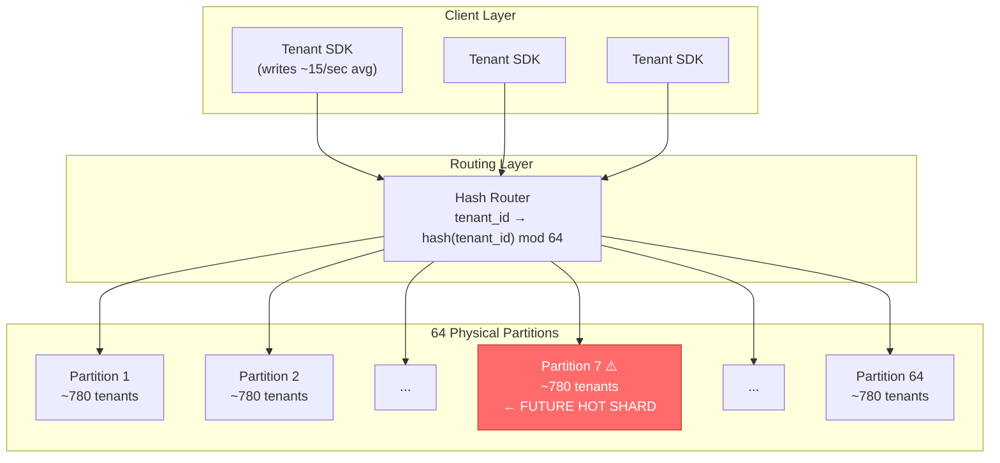

**Normal operating conditions:**

| Metric | Value |
|--------|-------|
| Total tenants | 50,000 |
| Partitions | 64 |
| Avg tenants/partition | ~780 |
| Avg writes/tenant/sec | ~15 |
| Avg writes/partition/sec | ~11,700 |
| p50 latency | 18ms |
| p99 latency | 40ms |
| Alerts firing | None |

Everything looks healthy. The false sense of security begins here.

---

## 2. The False Assumptions

Five assumptions were baked silently into the design. All five are wrong in real multi-tenant systems.

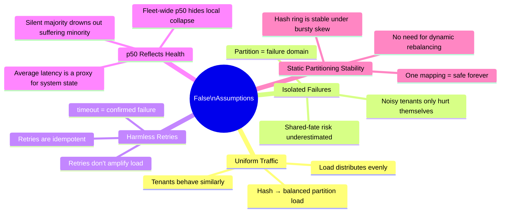

### The Core Mistake in One Line

> **You sharded by `tenant_id` hash alone — optimizing for average balance, not isolation under skew.**

`tenant_id → hash(tenant_id) mod 64` gives you uniformity in expectation. But production workloads are not expectations. They are distributions with fat tails — and the tail is what kills you.

---

## 3. The Failure Cascade: Step by Step

### Phase 0 → Phase 5: Full Collapse Sequence

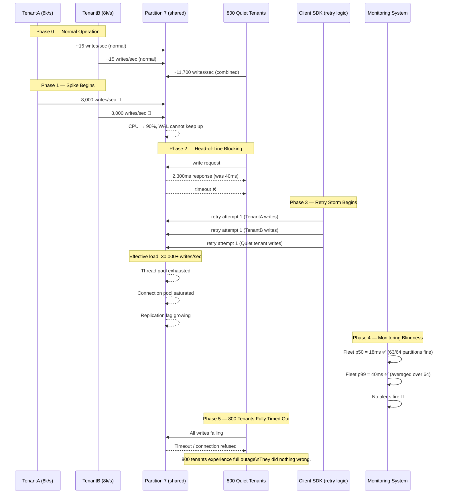

---

### Phase 3 Deep Dive: The Retry Storm Amplification

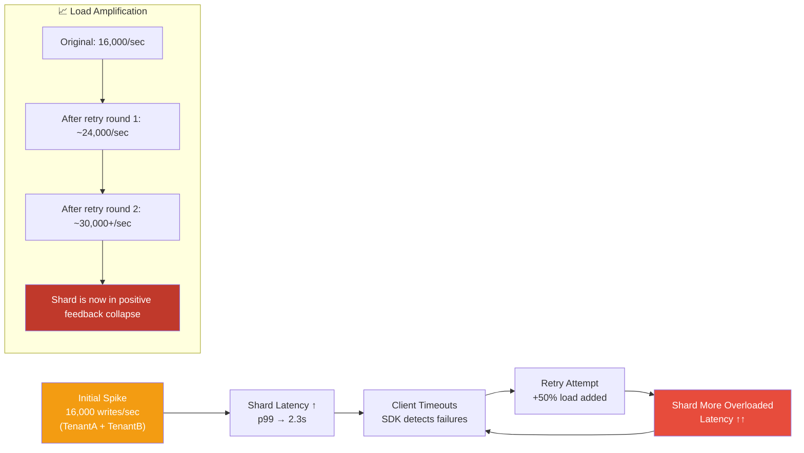

---

### The Shared-Fate Topology (Why Quiet Tenants Pay the Price)

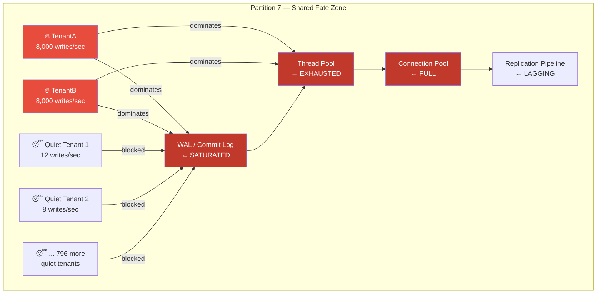

> **Key insight:** Partition 7 is both the physical shard AND the shared failure domain. There is no isolation between tenants on the same partition. `tenant_id` isolation exists only as a logical concept — physically, resources are fully shared.

---

## 4. Why Your Monitoring Missed It

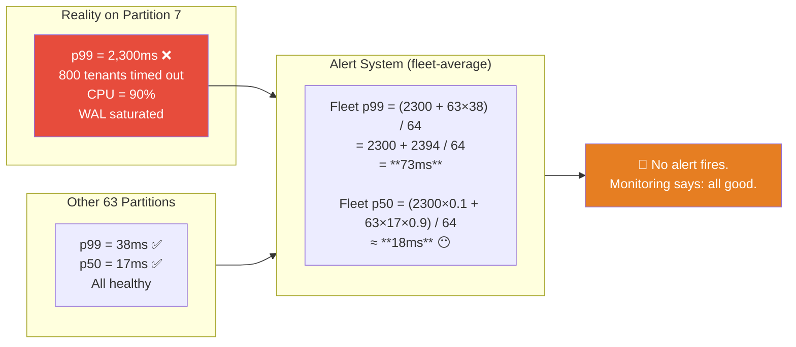

### The Mathematical Reason Averages Lie

```
63 healthy partitions × p99=38ms  → contribute 2,394ms to sum
1 dying partition    × p99=2,300ms → contributes 2,300ms to sum

Fleet p99 alert = (2300 + 2394) / 64 = 73ms

Your alert threshold was probably 500ms or 1s.
73ms → no alert.
```

> **Golden rule of distributed systems:** Averages hide failures. Percentiles per partition, per tenant are the only honest signal.

---

## 5. Problems with the Current Implementation

### 5.1 Sharding Model: No Tenant Isolation

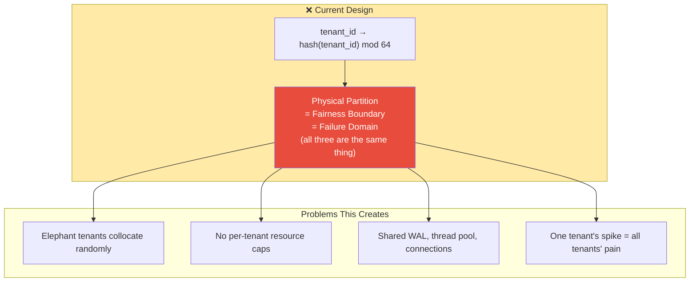

### 5.2 Retry Logic: Amplifies Instead of Backs Off

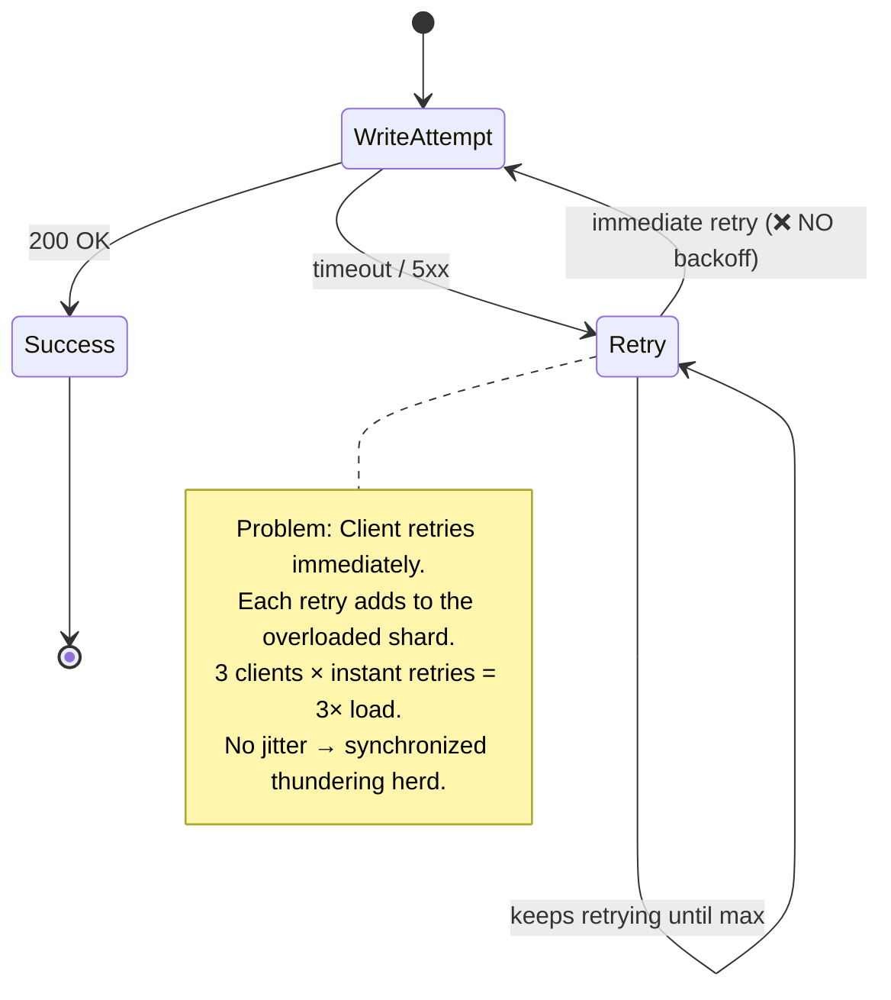

### 5.3 Monitoring: Wrong Granularity

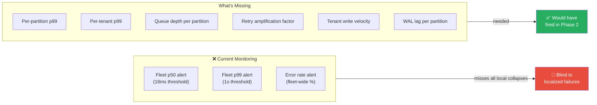

---

## 6. The Fix

> **Constraint:** No full rehash of 50,000 tenants (massive data movement, cache invalidation, correctness risk under retries). All fixes must be incremental and online.

### Fix 1: Tenant-to-Partition Indirection Layer (Virtual Shards)

Instead of a direct hash, introduce a metadata indirection layer.

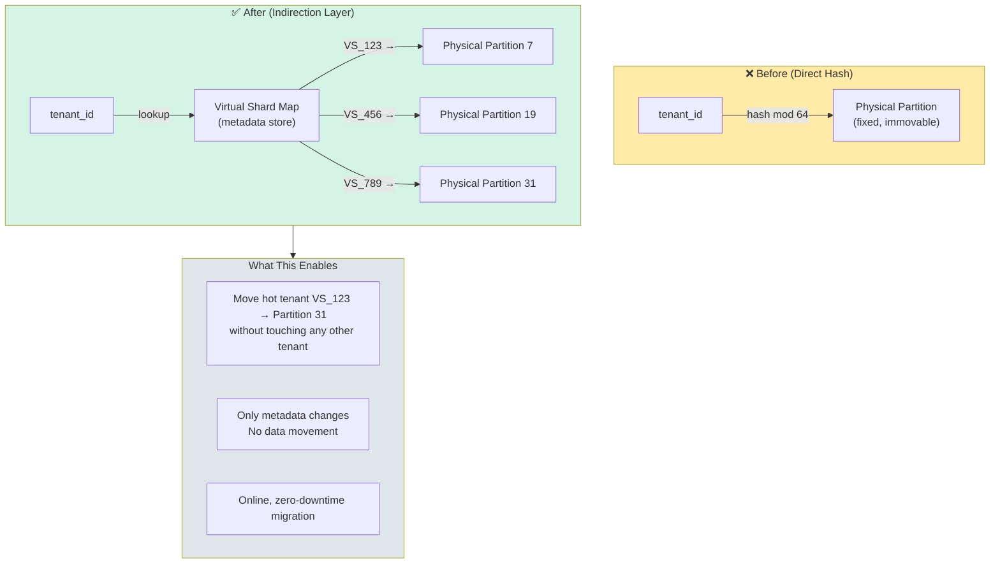

**Before:**
```
TenantA → hash("TenantA") mod 64 → Partition 7 (immovable)
TenantB → hash("TenantB") mod 64 → Partition 7 (immovable)
```

**After:**
```
TenantA → shard_map["TenantA"] → VS_101 → Partition 7
TenantB → shard_map["TenantB"] → VS_202 → Partition 7

# Detection fires. Hot-tenant extraction:
TenantA → shard_map["TenantA"] → VS_101 → Partition 31 (dedicated)
TenantB stays on Partition 7 (or also moves)
```

---

### Fix 2: Dynamic Hot-Tenant Detection and Extraction

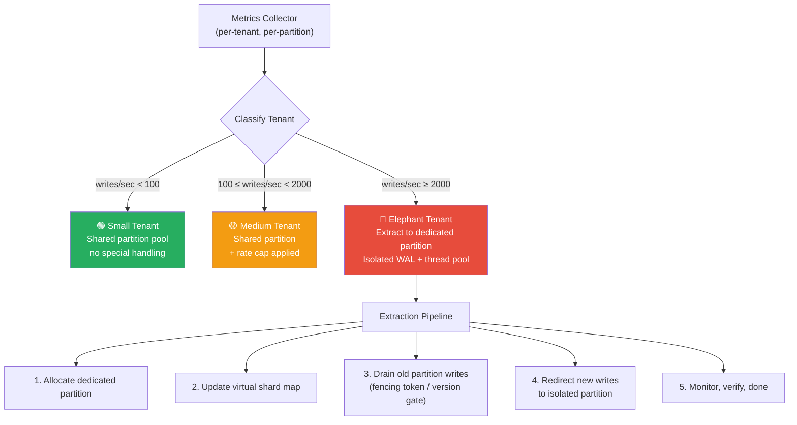

**Metrics to track per tenant:**

| Signal | Why |
|--------|-----|
| writes/sec | Primary overload signal |
| Queue depth contribution | Who is filling the queue |
| Retry rate | Who is amplifying load |
| CPU share on partition | Resource hog identification |
| WAL pressure | Storage layer stress |
| p99 per tenant | Individual experience signal |

---

### Fix 3: Per-Tenant Rate Limiting and Fair Queuing

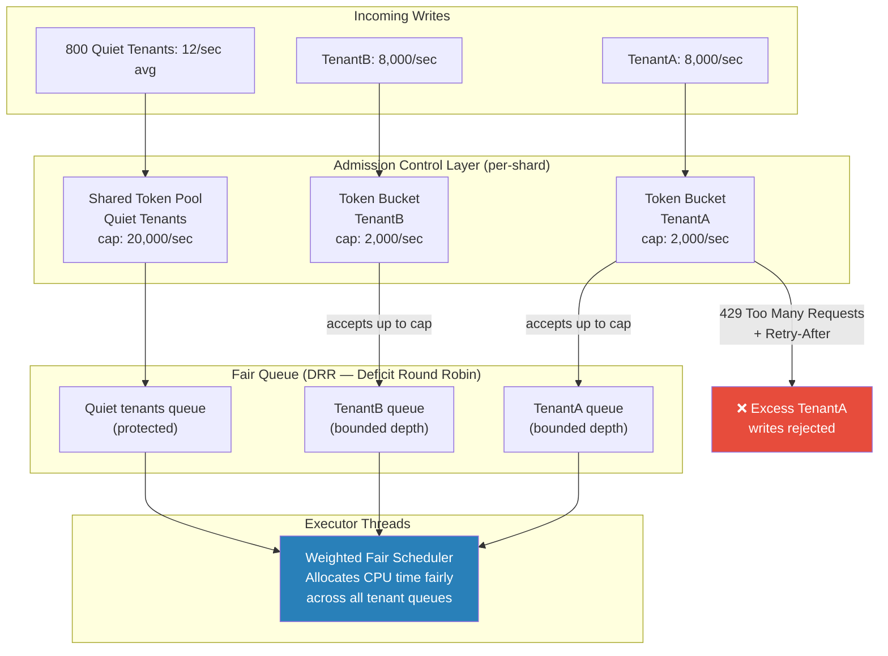

> **Fairness > Throughput.** The quiet tenants must always make progress, even if TenantA and TenantB are going berserk. DRR (Deficit Round Robin) scheduling ensures no tenant can starve others.

---

### Fix 4: Retry Budget and Backpressure

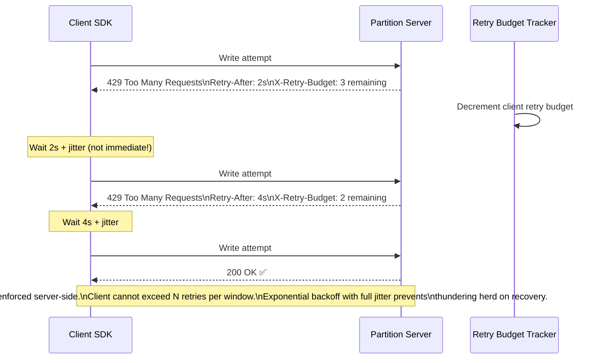

**Retry Policy Rules:**

```
✅ Exponential backoff:  base=100ms, max=30s
✅ Full jitter:           sleep = random(0, min(cap, base * 2^attempt))
✅ Retry budget:          max 3 retries per request, tracked per client
✅ Server pushback:       429 + Retry-After header
✅ Bounded queues:        reject at queue depth limit, not at timeout
❌ Never:                 instant retry on timeout
❌ Never:                 unbounded retry loops
❌ Never:                 synchronized retry (no jitter)
```

---

### Fix 5: Tail-Latency-Aware Monitoring

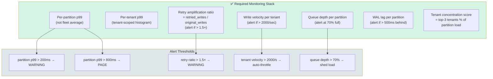

---

### Fix 6: Queue Isolation (Eliminate Head-of-Line Blocking)

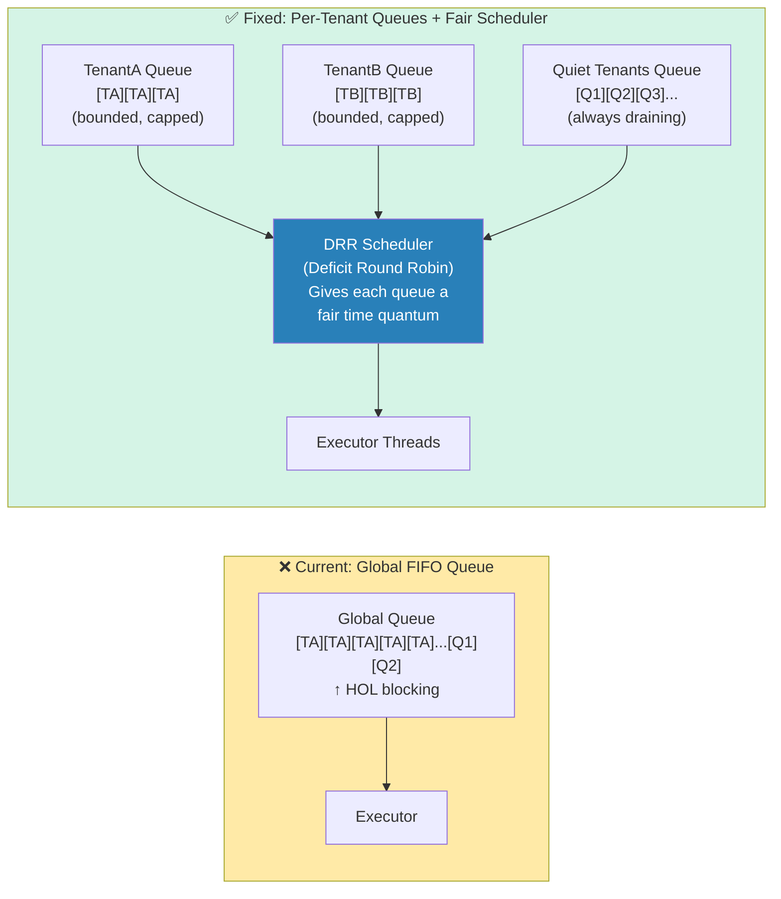

---

### Complete Fixed Architecture

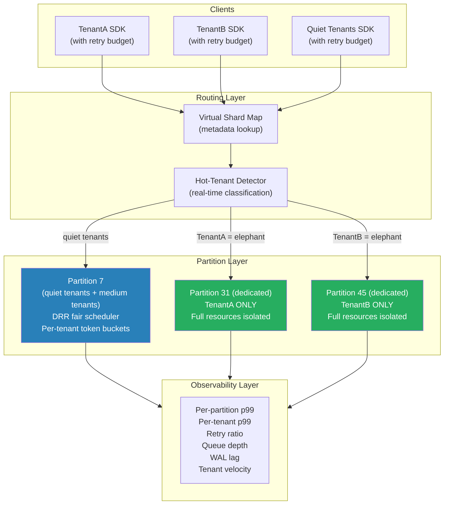

---

## 7. How Real Companies Solved This

### 7.1 AWS DynamoDB — Adaptive Capacity + Request Routing

**Problem:** Same hot-partition problem at massive scale. DynamoDB had to handle uneven access patterns without requiring users to re-shard.

**Solution:**
- **Adaptive Capacity** (launched 2019): Automatically identifies hot partitions and gives them extra throughput from the unused capacity of adjacent partitions. No user action required.
- **Request routing to replicas:** Hot-key reads are spread across all three replicas instead of routing to the leader.
- **Burst capacity:** Each partition has a 5-minute burst buffer to absorb spikes without immediately throttling.

> 📎 [AWS re:Invent 2018 - DynamoDB Deep Dive: Advanced Design Patterns](https://www.youtube.com/watch?v=HaEPXoXVf2k)
> 📎 [DynamoDB Adaptive Capacity Documentation](https://docs.aws.amazon.com/amazondynamodb/latest/developerguide/bp-partition-key-design.html)

---

### 7.2 Stripe — Per-Tenant Rate Limiting and Tenant Classification

**Problem:** Processing payments for millions of merchants means some merchants have 1000× the traffic of others. A flash sale at a major retailer can spike to millions of requests in minutes.

**Solution:**
- **Tiered tenant classification:** Small, medium, large, enterprise — each with different rate limits and infrastructure isolation.
- **Token bucket rate limiting** per API key at the edge — before requests hit any data store.
- **Dedicated processing lanes** for high-volume merchants: separate Kafka topics, separate database replicas.
- Server-side `429 Too Many Requests` with `Retry-After` and exponential backoff guidance in response headers.

> 📎 [Stripe Engineering: Scaling Stripe's Rate Limiting](https://stripe.com/blog/rate-limiters)

---

### 7.3 Netflix — Chaos Engineering + Isolation

**Problem:** Shared microservices caused cascading failures when one service's traffic spike starved threads for unrelated services.

**Solution:**
- **Bulkhead pattern** (via Hystrix, now Resilience4j): Each downstream dependency gets its own thread pool. One service collapsing cannot starve threads meant for another.
- **Adaptive concurrency limits:** Concurrency limits per service automatically adjust based on observed latency (TCP-like congestion control for services).
- **Chaos Monkey:** Proactively validates that isolation actually works before production incidents reveal it doesn't.

> 📎 [Netflix Tech Blog: Fault Tolerance in a High Volume, Distributed System](https://netflixtechblog.com/fault-tolerance-in-a-high-volume-distributed-system-91ab4faae74a)

---

### 7.4 Google Spanner — Hotspot Detection + Dynamic Splitting

**Problem:** At planet-scale, any hash-based sharding eventually produces hot spots. Spanner serves as the backend for many Google services that have extremely uneven key distributions.

**Solution:**
- **Dynamic split points:** Spanner monitors read/write rate per key range. If a range becomes a hot spot, it automatically splits it into smaller ranges and distributes them across servers.
- **Server-side load balancing:** Ranges are moved between servers based on real-time load — no application-side awareness needed.
- **Per-key rate statistics:** Spanner tracks per-key access patterns and uses this to inform split decisions.

> 📎 [Google Spanner Paper (OSDI 2012)](https://research.google/pubs/pub39966/)
> 📎 [Cloud Spanner: Automatic Hotspot Handling](https://cloud.google.com/spanner/docs/schema-design#hotspots)

---

### 7.5 Apache Kafka — Partition Re-assignment + Consumer Isolation

**Problem:** Kafka topics with uneven message rates caused some partitions to lag behind, causing consumer timeouts for unrelated topic consumers sharing the same broker.

**Solution:**
- **Partition reassignment tool:** Hot partitions can be moved to less-loaded brokers without full topic recreation.
- **Separate consumer groups per tenant class:** High-volume topics go to dedicated consumer groups and brokers.
- **`max.poll.records` and `fetch.max.bytes` tuning:** Limit how much one consumer can consume in a single poll cycle, preventing starvation.

> 📎 [Confluent: Avoiding Kafka Consumer Group Rebalancing](https://www.confluent.io/blog/kafka-consumer-multi-threaded-messaging/)

---

### Summary: What Each Company's Solution Maps To

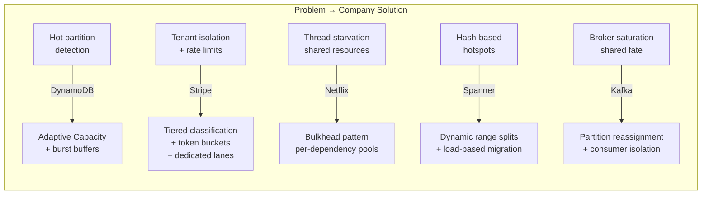

---

## 8. Bottlenecks Resolved: Summary Matrix

| # | Bottleneck | Root Cause | Fix Applied | Result |
|---|------------|------------|-------------|--------|
| 1 | **Hot partition collapse** | Two elephant tenants collocated by random hash | Virtual shard indirection + hot-tenant extraction to dedicated partitions | Elephant tenants isolated; quiet tenants unaffected |
| 2 | **Retry storm amplification** | Instant retries on timeout, no backoff, no server pushback | Exponential backoff + full jitter + server-side `429 + Retry-After` + client retry budget | Load amplification eliminated |
| 3 | **Head-of-line blocking** | Global FIFO queue per partition, no per-tenant isolation | Per-tenant queues + DRR (Deficit Round Robin) fair scheduler | 800 quiet tenants always drain, regardless of elephant behavior |
| 4 | **Silent monitoring failure** | Fleet-average p50/p99 metrics mask localized shard collapse | Per-partition p99 + per-tenant p99 + queue depth + retry ratio alerts | Partition 7 collapse detected in Phase 2, before cascade |
| 5 | **No admission control** | No per-tenant resource caps at the shard level | Token bucket rate limiting per tenant, per partition | Single tenant cannot saturate WAL, thread pool, or connections |
| 6 | **Static partitioning instability** | Hash ring fixed forever, no online rebalancing | Dynamic tenant classification + automated hot-shard extraction pipeline | System adapts online; no manual rehash required |
| 7 | **Shared failure domain** | Physical partition = fairness boundary = failure domain (all same) | Separate isolation boundaries: tenant queue / retry budget / admission control are independent of physical partition | Failure domain is now per-tenant, not per-partition |

---

## 9. Closing Statement

> *For the Amazon SDE-3 interviewer:*

**"The root cause was a single false assumption: consistent hashing alone provides safe multi-tenant distribution. It optimizes for average balance, not for isolation under skew.**

**In practice, two elephant tenants collocated by hash onto Partition 7. Their combined 16,000 writes/sec saturated the WAL, thread pool, and connection pool. Client SDKs retried immediately, amplifying load to 30,000+ writes/sec — a self-inflicted DDoS on an already dying shard. Fleet-level p50 stayed at 18ms because 63 of 64 partitions were healthy; the monitoring never fired. 800 innocent tenants experienced full timeouts.**

**I'd fix this incrementally:**

**1. Introduce a tenant → virtual shard → physical partition indirection layer so hot tenants can be extracted without a full rehash.**
**2. Detect elephant tenants dynamically by tracking per-tenant write velocity, queue depth, and WAL pressure — then automatically migrate them to dedicated partitions.**
**3. Enforce per-tenant admission control using token buckets and DRR fair queuing so one tenant cannot starve 800 others.**
**4. Replace instant retries with exponential backoff, full jitter, and server-side `429 + Retry-After` signaling to break the positive feedback loop.**
**5. Replace fleet-average alerts with per-partition and per-tenant p99, queue depth, and retry amplification ratio — so localized collapse is visible before it cascades.**

**The deepest architectural insight is this: in multi-tenant systems, the failure domain must be the tenant, not the physical partition. Consistent hashing gives you average balance. What you actually need is isolation under skew."**

---

*References:*
- [AWS DynamoDB Adaptive Capacity](https://docs.aws.amazon.com/amazondynamodb/latest/developerguide/bp-partition-key-design.html)
- [Stripe Rate Limiters Blog](https://stripe.com/blog/rate-limiters)
- [Netflix Fault Tolerance Blog](https://netflixtechblog.com/fault-tolerance-in-a-high-volume-distributed-system-91ab4faae74a)
- [Google Spanner OSDI 2012 Paper](https://research.google/pubs/pub39966/)
- [Cloud Spanner Hotspot Avoidance](https://cloud.google.com/spanner/docs/schema-design#hotspots)
- [AWS re:Invent DynamoDB Deep Dive (video)](https://www.youtube.com/watch?v=HaEPXoXVf2k)
- [Marc Brooker on Jitter and Backoff](https://aws.amazon.com/builders-library/timeouts-retries-and-backoff-with-jitter/)
- [Google SRE Book — Handling Overload](https://sre.google/sre-book/handling-overload/)
