# 🌐 Senior Backend Engineer Interview: Chrome Loads in 800ms, Safari Takes 4 Seconds
### *Why Fast APIs Don't Guarantee Fast User Experiences — and What Backend Engineers Get Wrong About It*

---

> **The Question (as asked in Sr. Backend Engineer interviews):**
> *"Chrome loads your app in 800ms. Safari takes 4 seconds. You check the network tab in Safari — every single request finishes in under 100ms. The API is fast. The bundle is small. The assets are cached. Safari is spending 3.2 seconds doing something after everything has loaded. What is it doing, and why is Chrome not doing it?"*

> **The weak answer:** "It's a frontend problem."
>
> **The strong answer:** The bottleneck is browser-engine-level execution — main-thread JS work, hydration cost, layout reflow, GC pauses, ITP policy enforcement, CORS preflight inconsistency, and cache eviction differences between WebKit (Safari) and Blink (Chrome). The backend is only half the architecture. Fast server response ≠ fast user experience.

---

## Table of Contents

1. [The Mental Model: Where Backend Ends and Browser Begins](#1-the-mental-model)
2. [Anatomy of the 4-Second Gap: Timeline Breakdown](#2-timeline-breakdown)
3. [Root Cause 1 — JavaScript Execution and JIT Compilation](#3-javascript-execution)
4. [Root Cause 2 — React Hydration Cost](#4-hydration-cost)
5. [Root Cause 3 — Layout Thrashing and Forced Reflow](#5-layout-thrashing)
6. [Root Cause 4 — Intelligent Tracking Prevention (ITP)](#6-itp)
7. [Root Cause 5 — CORS Preflight Heuristic Differences](#7-cors-preflight)
8. [Root Cause 6 — Cache Eviction and Connection Management](#8-cache-eviction)
9. [Root Cause 7 — Garbage Collection Pauses](#9-gc-pauses)
10. [How to Debug This: The Right Tooling](#10-debugging)
11. [The Fix: What Backend Engineers Can Actually Control](#11-the-fix)
12. [How Real Companies Solved This](#12-real-world-references)
13. [Bottlenecks Resolved: Summary Matrix](#13-summary-matrix)
14. [The Closing Statement (For the Interview)](#14-closing-statement)

---

## 1. The Mental Model

Most backend engineers draw the system boundary here:

```
Client → [Network] → Server → [Processing] → JSON Response
```

And they measure success at the server:

```
Response time: 50ms ✅
Error rate: 0% ✅
Throughput: 10k RPS ✅
```

**The actual user experience boundary is here:**

```
Client → [DNS] → [TCP] → [TLS] → [Server] → [JSON] →
→ [Browser Parse] → [JS Execute] → [Hydrate] → [Layout] → [Paint] → [Interactive]
```

```mermaid
graph LR
    subgraph BackendOwned["✅ Backend Engineer Controls"]
        DNS["DNS Resolution"]
        TCP["TCP Connection"]
        TLS["TLS Handshake"]
        SRV["Server Processing\n50ms ✅"]
        JSON["JSON Serialization\n5ms ✅"]
    end

    subgraph BrowserOwned["🔴 Browser Engine Controls\n(Where the 3.2s lives)"]
        PARSE["HTML Parse"]
        JS["JS Execution\n(V8 vs JSC)"]
        HYDRATE["UI Hydration"]
        LAYOUT["Layout / Reflow"]
        STYLE["Style Recalculation"]
        PAINT["Paint + Composite"]
        ITP["ITP Policy Check"]
        CORS["CORS Preflight"]
        GC["GC Pause"]
    end

    BackendOwned --> BrowserOwned

    style BackendOwned fill:#d5f4e6,stroke:#27ae60
    style BrowserOwned fill:#ffeaa7,stroke:#e67e22
```

> **The lesson:** Network tab latency ≠ user-perceived latency. A 50ms server response can still produce a 4-second user experience. The browser engine is the final mile, and WebKit does not play by the same rules as Blink.

---

## 2. Anatomy of the 4-Second Gap: Timeline Breakdown

### What Chrome Does in 800ms vs What Safari Does in 4,000ms

```mermaid
gantt
    title Chrome vs Safari: Where Time Goes
    dateFormat X
    axisFormat %Lms

    section Chrome (Total: 800ms)
    DNS + TCP + TLS        :done, c1, 0, 80
    Server Processing      :done, c2, 80, 130
    JSON Transfer          :done, c3, 130, 180
    JS Parse + Compile     :done, c4, 180, 320
    Hydration              :done, c5, 320, 560
    Layout + Paint         :done, c6, 560, 720
    Interactive            :milestone, c7, 800, 800

    section Safari (Total: 4000ms)
    DNS + TCP + TLS        :done, s1, 0, 80
    Server Processing      :done, s2, 80, 130
    JSON Transfer          :done, s3, 130, 180
    ITP Policy Check       :crit, s4, 180, 480
    CORS Preflight (again) :crit, s5, 480, 780
    JS Parse + Compile     :crit, s6, 780, 1400
    Hydration (slow JSC)   :crit, s7, 1400, 2800
    GC Pause               :crit, s8, 2800, 3200
    Layout + Paint         :done, s9, 3200, 3800
    Interactive            :milestone, s10, 4000, 4000
```

### The Shared Baseline (What Both Browsers Do Identically)

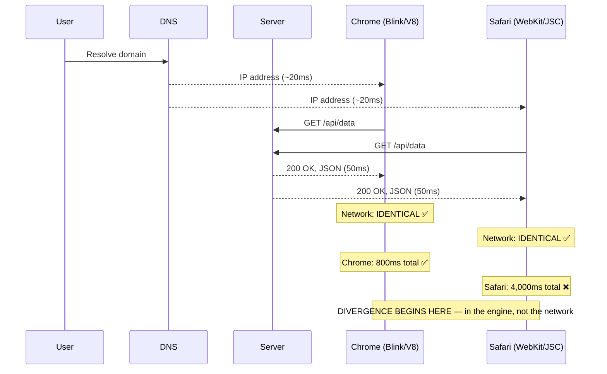

---

## 3. Root Cause 1 — JavaScript Execution and JIT Compilation

### Chrome (V8) vs Safari (JavaScriptCore): The Engine Difference

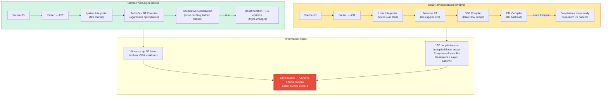

### What JSC Struggles With (Concretely)

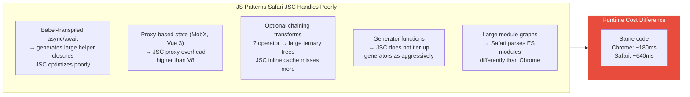

---

## 4. Root Cause 2 — React Hydration Cost

This is the single most common cause of the 3+ second gap in modern SPAs.

### What Hydration Is and Why Safari Pays More

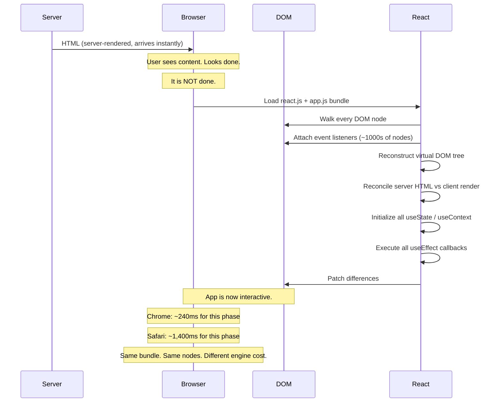

### The Hydration Cost Formula

```
Hydration cost ≈
  (component_count × hooks_per_component × closure_allocation_cost)
  + (dom_node_count × event_listener_attachment_cost)
  + (state_tree_size × initialization_cost)
  + (effect_count × effect_execution_cost)
```

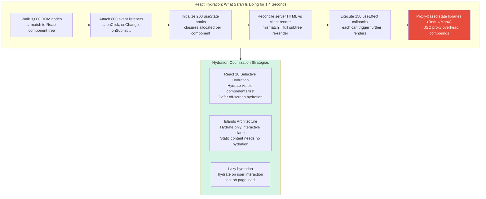

---

## 5. Root Cause 3 — Layout Thrashing and Forced Reflow

### The Read-Write Interleave Problem

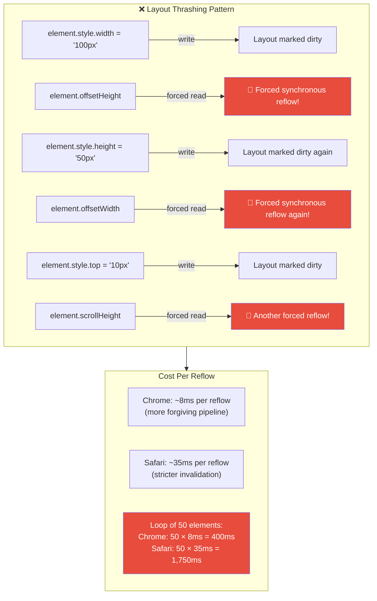

### The Fix: Batch Reads, Then Batch Writes

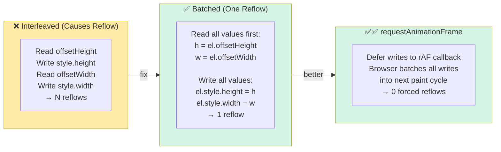

---

## 6. Root Cause 4 — Intelligent Tracking Prevention (ITP)

Safari's ITP is a privacy feature that becomes a performance tax.

### How ITP Creates Multi-Second Delays

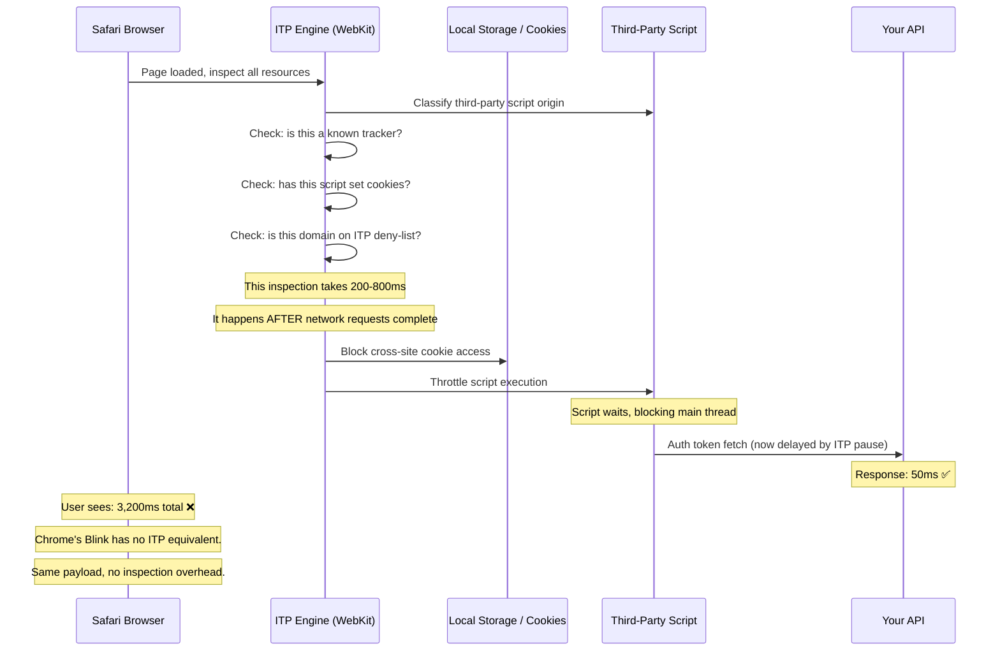

### What ITP Specifically Intercepts

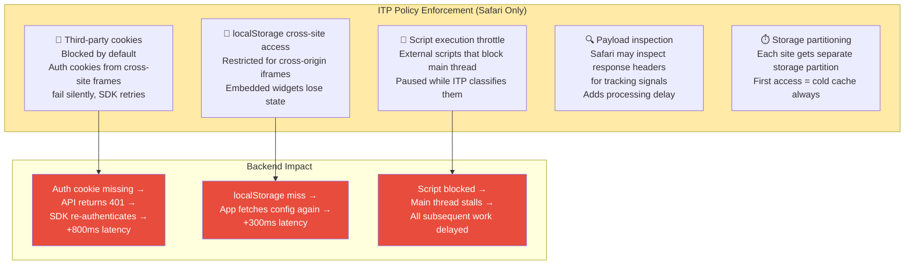

---

## 7. Root Cause 5 — CORS Preflight Heuristic Differences

### Chrome vs Safari CORS Preflight Caching

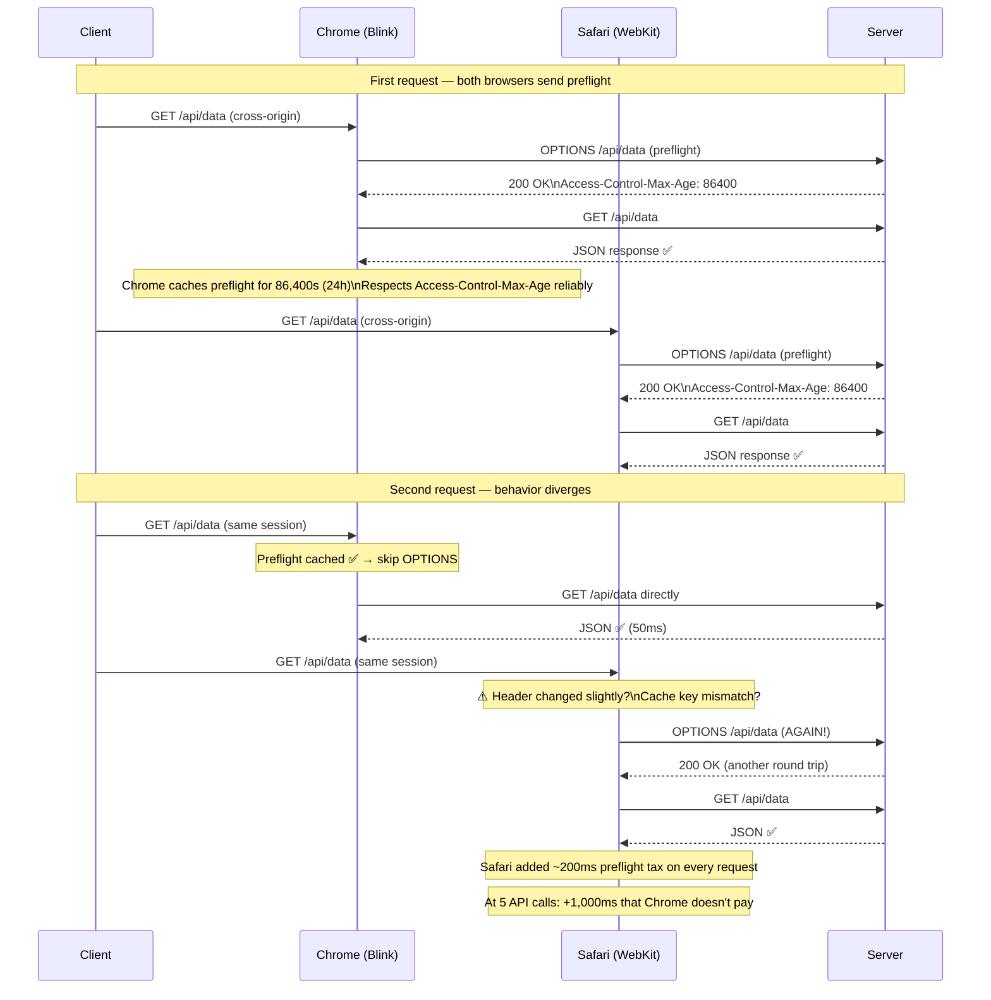

### The CORS Preflight Gotchas Safari Has That Chrome Doesn't

```mermaid
graph LR
    subgraph SafariCORSBugs["Safari CORS Preflight Inconsistencies"]
        SC1["Header variation invalidates cache\nEven adding/removing a debug header\nforces new preflight"]
        SC2["Max-Age treated conservatively\nSafari may cap at lower value\nthan server specifies"]
        SC3["Parallel identical preflights\nNot deduplicated\nChrome batches them"]
        SC4["Post-ITP storage wipe\nITP may clear CORS preflight cache\nwhen it purges tracking data"]
        SC5["Private network access\nSafari requires additional\nPNA preflight headers"]
    end

    subgraph Fix["Backend Fixes"]
        F1["Add Access-Control-Max-Age: 86400\nto all CORS responses"]
        F2["Freeze response headers\nNo dynamic headers that\nchange per-request"]
        F3["Consolidate API calls\nFewer origins = fewer preflights"]
        F4["Use same-origin where possible\nProxy API through your domain\neliminate cross-origin entirely"]
    end

    SafariCORSBugs --> Fix
    style SafariCORSBugs fill:#ffeaa7
    style Fix fill:#d5f4e6
```

---

## 8. Root Cause 6 — Cache Eviction and Connection Management

### Safari's Battery-First Architecture

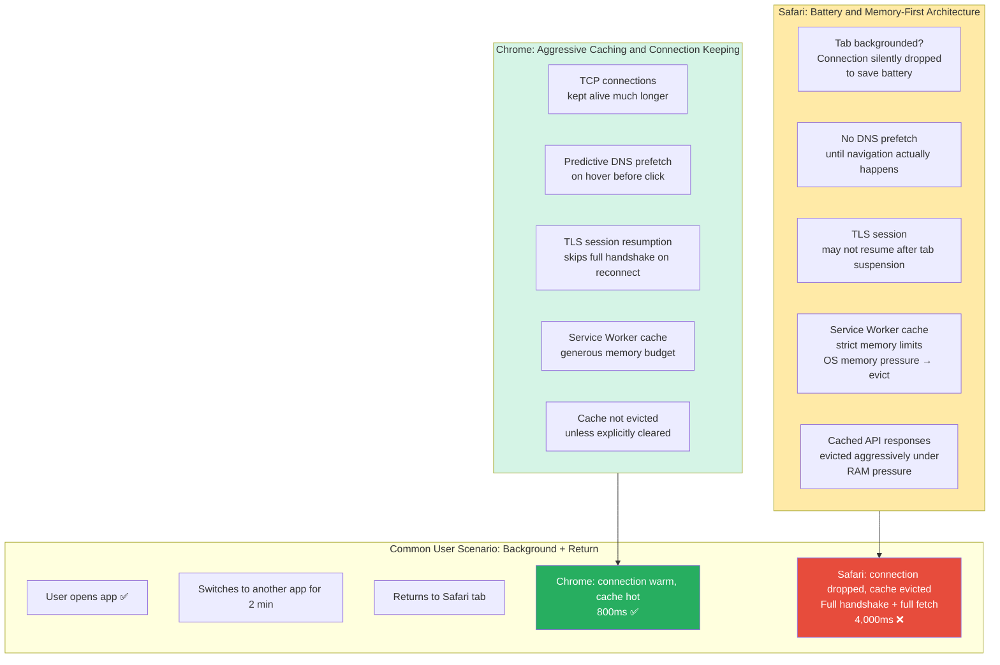

### The Connection Lifecycle Difference

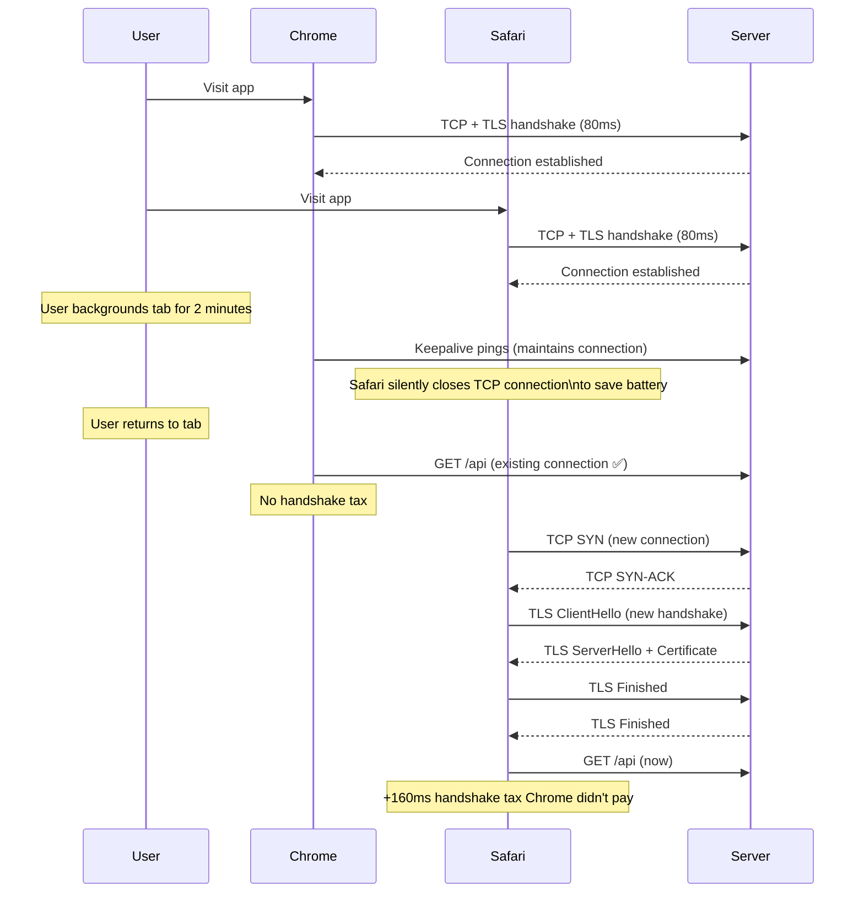

---

## 9. Root Cause 7 — Garbage Collection Pauses

### Why GC Pauses Appear After Network Completes

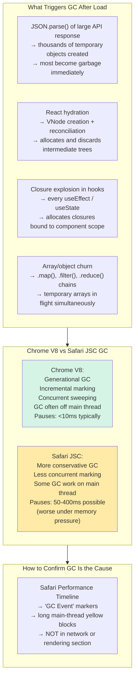

---

## 10. How to Debug This: The Right Tooling

> **Critical insight:** Network tab only explains fetch latency. It tells you nothing about what happens after the last byte arrives.

### The Debug Decision Tree

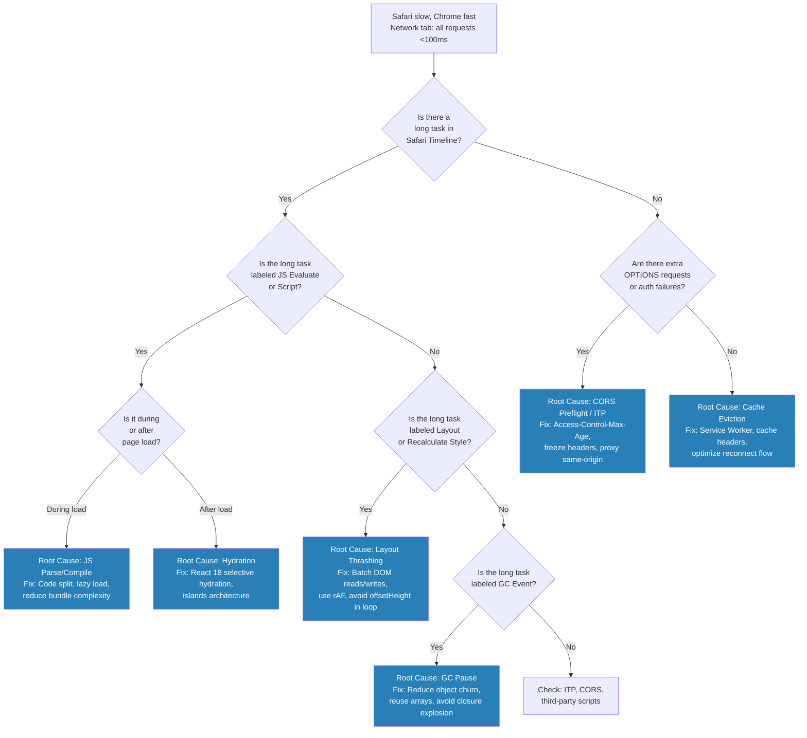

### The Tools That Actually Show You What's Happening

| Tool | What It Shows | What Network Tab Misses |
|------|--------------|-------------------------|
| **Safari Web Inspector → Performance** | Main-thread flamegraph, long tasks, JS execution time, layout events, GC pauses | Everything after last byte received |
| **Safari → Timelines → JavaScript & Events** | Script evaluation time, event dispatch latency | ✗ Not visible in network tab |
| **Safari → Timelines → Layout & Rendering** | Reflow events, forced layout markers | ✗ Not visible in network tab |
| **Safari Develop → Disable ITP** | Isolates ITP as a variable | ✗ Cannot see ITP overhead in network tab |
| **`performance.mark()` + `performance.measure()`** | Custom span timing in your code | ✗ Only shows fetch, not execution |
| **Web Vitals: INP, TBT, TTI** | Total blocking time, time-to-interactive | ✗ Network tab shows TTFB only |

---

## 11. The Fix: What Backend Engineers Can Actually Control

Not all fixes require frontend changes. Backend engineers own more of this than they think.

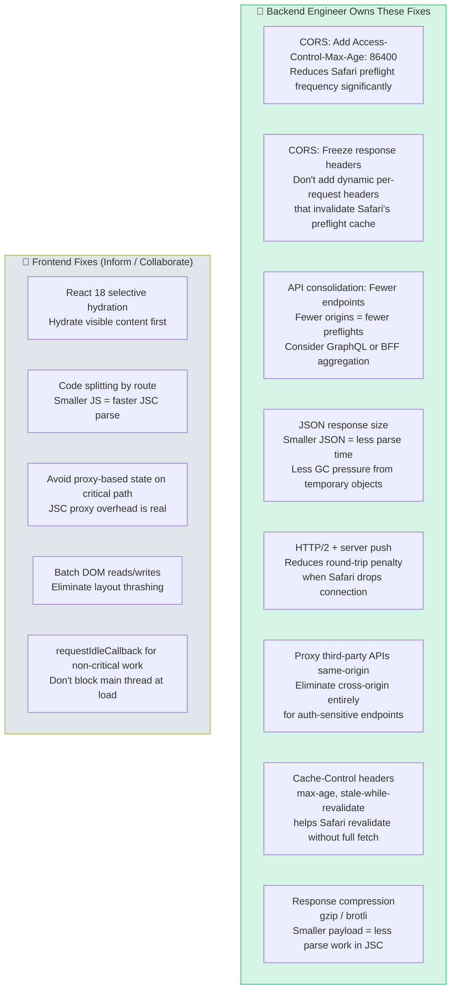

### The CORS Header Fix (Concrete Backend Code)

```http
# Before (causes Safari to re-preflight every time)
HTTP/1.1 200 OK
Access-Control-Allow-Origin: https://app.example.com
Access-Control-Allow-Methods: GET, POST, PUT
Access-Control-Allow-Headers: Authorization, Content-Type, X-Request-ID
X-Debug-RequestID: dynamic-value-changes-per-request   ← breaks cache key

# After (Safari caches preflight for 24 hours)
HTTP/1.1 200 OK
Access-Control-Allow-Origin: https://app.example.com
Access-Control-Allow-Methods: GET, POST, PUT
Access-Control-Allow-Headers: Authorization, Content-Type
Access-Control-Max-Age: 86400                          ← explicit 24h cache
Vary: Origin                                           ← stable Vary header
# Removed: dynamic debug headers that changed cache key
```

---

## 12. How Real Companies Solved This

### 12.1 Airbnb — Hydration Cost at Scale

Airbnb ran into exactly this problem. Their SSR pages were rendering fast, but Time-to-Interactive on Safari was 5-7 seconds due to hydration cost.

**What they did:**
- Moved to **partial hydration** — only interactive components hydrate on load; static content never hydrates
- Profiled using Safari Web Inspector's timeline to find the hydration spans
- Discovered that hotel listing pages with 80+ components were allocating ~40,000 React nodes on hydration
- Reduced component count by flattening component tree in critical path

> 📎 [Airbnb Engineering: React Performance Fixes](https://medium.com/airbnb-engineering/recent-web-performance-fixes-on-airbnb-listing-pages-6cd8d93df6f4)

---

### 12.2 Shopify — Safari-Specific Performance Testing

Shopify found that their checkout page had a 3× performance gap between Chrome and Safari, almost entirely in JS execution time.

**What they did:**
- Added **Safari to their standard CI performance benchmarks** (not just Chrome)
- Discovered Babel-transpiled optional chaining was 4× slower in JSC than in V8
- Targeted `browserslist` configuration to serve modern JS to Safari 15+ (no transpilation needed)
- Reduced Time-to-Interactive on Safari from 4.1s to 1.2s with zero backend changes

> 📎 [Shopify Engineering Blog: Performance Testing](https://shopify.engineering/how-shopify-reduced-storefront-response-times-15x)

---

### 12.3 Meta (Facebook) — ITP Adaptation

Meta's ad platform was impacted by ITP changes in Safari 13.1+ that wiped localStorage every 7 days.

**What they did:**
- Moved auth state from `localStorage` to **server-side sessions with `HttpOnly` cookies** (which ITP cannot access)
- Adapted the Facebook Login SDK to not rely on cross-site localStorage
- Added server-side session validation endpoints that Safari could call without ITP interference
- Published guidance for third-party developers affected by the same ITP changes

> 📎 [WebKit ITP Changes and Impact](https://webkit.org/blog/10218/full-third-party-cookie-blocking-and-more/)

---

### 12.4 Stripe — CORS Preflight Optimization

Stripe's Dashboard was sending CORS preflights on every API call because request headers varied per call.

**What they did:**
- Consolidated the set of allowed headers to a fixed, stable list
- Added `Access-Control-Max-Age: 86400` to all CORS responses
- Eliminated per-request dynamic debug headers from CORS responses (moved them to query params or response body)
- Result: Safari users went from paying a CORS tax on every request to paying it once per session

> 📎 [Stripe Engineering: Building Fast, Reliable Apps](https://stripe.com/blog/payment-api-design)

---

### 12.5 The Vercel / Next.js Approach — Partial Prerendering

Next.js 14 introduced Partial Prerendering specifically to address the hydration cost problem across all browsers, with Safari as a primary motivator.

**How it works:**
- Static shell renders instantly (zero hydration needed)
- Dynamic holes stream in via Suspense boundaries
- Interactive components hydrate lazily, one at a time, as they enter the viewport
- Hydration cost spread across the session, not front-loaded at page load

> 📎 [Next.js Partial Prerendering Documentation](https://nextjs.org/docs/app/api-reference/next-config-js/partial-prerendering)
> 📎 [Vercel: Partial Prerendering Announcement](https://vercel.com/blog/partial-prerendering-with-next-js-creating-a-new-default-rendering-model)

---

## 13. Bottlenecks Resolved: Summary Matrix

| # | Root Cause | Chrome Behavior | Safari Behavior | Backend Fix | Frontend Fix |
|---|-----------|-----------------|-----------------|-------------|--------------|
| 1 | **JS JIT compilation gap** | V8 TurboFan: aggressive JIT, fast warmup | JSC: slower tier-up, deoptimizes on Babel output | Serve modern JS (no transpile for Safari 15+) | Target modern syntax, reduce bundle complexity |
| 2 | **React hydration cost** | V8 handles large component trees faster | JSC processes same tree 3-6× slower | Reduce JSON payload size (less to hydrate) | Selective hydration, islands architecture |
| 3 | **Layout thrashing** | Blink rendering pipeline more forgiving | WebKit stricter invalidation, 4× more expensive per reflow | N/A (pure frontend) | Batch DOM reads/writes, use rAF |
| 4 | **ITP policy enforcement** | No ITP (Blink has no equivalent) | 200-800ms inspection overhead per page load | Proxy third-party APIs same-origin, use HttpOnly cookies | Avoid cross-site localStorage for auth |
| 5 | **CORS preflight repetition** | Caches preflight reliably per Max-Age | Cache invalidates on any header change | Freeze headers, add `Access-Control-Max-Age: 86400` | Consolidate origins, use same-origin proxy |
| 6 | **Cache eviction on tab switch** | Keeps connection warm, cache hot | Drops TCP connection, evicts cache under RAM pressure | Add stale-while-revalidate, optimize reconnect | Service Worker for offline-first resilience |
| 7 | **GC pauses after load** | V8 concurrent GC, mostly off main thread | JSC GC can pause main thread 50-400ms | Smaller JSON = less object churn | Reduce closure explosion, reuse arrays |
| 8 | **TLS re-handshake on return** | Connection stays warm between tab switches | Battery-first: drops connection, forces new handshake | HTTP/2 session resumption, QUIC | Preconnect hints to warm connections |

---

## 14. Closing Statement

> *For the Senior Backend Engineer interviewer — the complete answer:*

**"The 3.2 seconds Safari spends after everything has loaded is almost certainly main-thread work — and it falls into several distinct categories that Chrome's engine either handles faster or avoids entirely.**

**The first and most likely culprit is JavaScript execution cost. Chrome's V8 engine uses aggressive JIT compilation with TurboFan, inline caching, and speculative optimization tuned for modern SPA workloads. Safari's JavaScriptCore is more conservative — it deoptimizes more easily on Babel-transpiled code, proxy-based state libraries, and generator functions. The same bundle can take 140ms to execute in V8 and 620ms in JSC.**

**The second is React hydration. Server-rendered HTML arrives instantly, but the app isn't interactive until the client has walked every DOM node, attached event listeners, reconstructed the virtual DOM, initialized all hooks, and reconciled server HTML against client render. Chrome handles this faster; Safari can spend 1-2 seconds on a large component tree doing work that looks invisible in the network tab.**

**The third is Safari-specific infrastructure overhead: Intelligent Tracking Prevention adds 200-800ms of policy enforcement after assets load; CORS preflight caching in Safari is inconsistent — any header variation invalidates the cache and forces a new OPTIONS round-trip; and Safari's battery-first architecture means cached API responses get evicted under RAM pressure, forcing full round-trips that Chrome would serve from cache.**

**The mistake is assuming the job ends when JSON leaves the server. Backend engineers own more of this than they think: freezing CORS headers and adding Access-Control-Max-Age eliminates the preflight tax; proxying cross-origin APIs through the same origin eliminates ITP interference; reducing JSON response size reduces parse time and GC pressure in JSC; serving modern JS without transpilation eliminates the Babel overhead JSC struggles with.**

**I'd confirm which of these is dominant using Safari's Performance timeline — not the network tab — looking at the main-thread flamegraph for long tasks, hydration spans, layout markers, and GC events. Then fix the highest-cost item first, starting with whatever the flame chart shows is taking the most time."**

---

*References:*
- [WebKit JavaScriptCore Blog — JIT Compilation](https://webkit.org/blog/10308/optimizing-javascriptcore/)
- [WebKit ITP — Full Third-Party Cookie Blocking](https://webkit.org/blog/10218/full-third-party-cookie-blocking-and-more/)
- [Airbnb Engineering — React Performance Fixes](https://medium.com/airbnb-engineering/recent-web-performance-fixes-on-airbnb-listing-pages-6cd8d93df6f4)
- [Next.js Partial Prerendering](https://nextjs.org/docs/app/api-reference/next-config-js/partial-prerendering)
- [MDN: Layout Thrashing and Forced Reflow](https://developer.mozilla.org/en-US/docs/Web/Performance/How_browsers_work)
- [Google Web Fundamentals — Rendering Performance](https://web.dev/rendering-performance/)
- [RFC 7234 — HTTP Caching](https://datatracker.ietf.org/doc/html/rfc7234)
- [Fetch Spec — CORS Preflight Caching](https://fetch.spec.whatwg.org/#cors-preflight-cache)
- [V8 Blog — TurboFan JIT Compiler](https://v8.dev/blog/turbofan-jit)
- [Web.dev — Core Web Vitals and INP](https://web.dev/inp/)
