# 🚗 Uber Interview: Why Does Uber Generate a Different OTP Per Ride?
### *The 4-Layer Systems Design Answer That Separates Senior Engineers From the Rest*

---

> **The Question (as asked in Uber interviews):**
> *"Why does Uber generate a different OTP for every single ride, while Rapido uses the same OTP? The same OTP is simpler, faster, and easier for users to remember — so why is Uber's approach better?"*

> **The weak answer:** "Security."
>
> **The strong answer:** State isolation, ride-level idempotency, fraud containment, concurrency correctness, blast radius reduction, and support reconciliation — all at the scope of the ride as a transactional unit.

---

## Table of Contents

1. [The Mental Model: OTP as User PIN vs OTP as Trip Token](#1-the-mental-model)
2. [System Architecture: How Uber Scopes the OTP](#2-system-architecture)
3. [Layer 1 — State Transition and Ride Lifecycle](#3-layer-1-state-transition)
4. [Layer 2 — Idempotency and Concurrency Correctness](#4-layer-2-idempotency)
5. [Layer 3 — Fraud, Replay Attacks, and Blast Radius](#5-layer-3-fraud)
6. [Layer 4 — Support, Reconciliation, and Audit Trail](#6-layer-4-audit)
7. [Why Rapido's Approach Is a Valid Engineering Trade-off](#7-rapido-tradeoff)
8. [The Backend Complexity Uber Accepts](#8-backend-complexity)
9. [How Real Companies Apply This Pattern](#9-real-world-references)
10. [Bottlenecks Resolved: Summary Matrix](#10-summary-matrix)
11. [The Closing Statement (For the Interview)](#11-closing-statement)

---

## 1. The Mental Model

Before any code or diagram: the entire answer hinges on one conceptual shift.

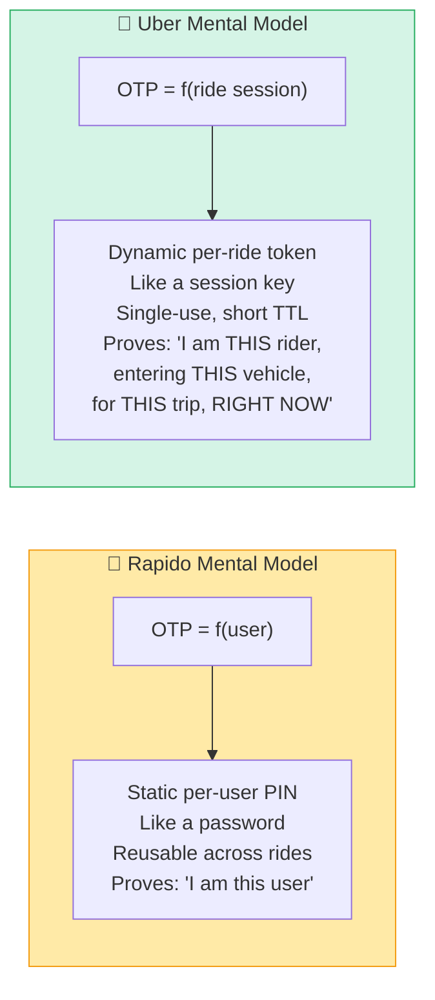

> **The shift:** From `user-scoped identity verification` → `transaction-scoped session authentication`

This is the exact same principle that separates:
- **Session cookies** (user-scoped) from **JWT tokens** (request-scoped)
- **API keys** (account-scoped) from **OAuth tokens** (scope+TTL-scoped)
- **Database passwords** (connection-scoped) from **row-level encryption keys** (record-scoped)

At small scale, user-scoped works fine. At Uber's scale — millions of concurrent rides, driver reassignments, multi-device logins, scheduled rides, family profiles — user-scoped authentication creates ambiguity that breaks everything downstream.

---

## 2. System Architecture

### 2.1 Rapido: User-Scoped OTP (Simplified)

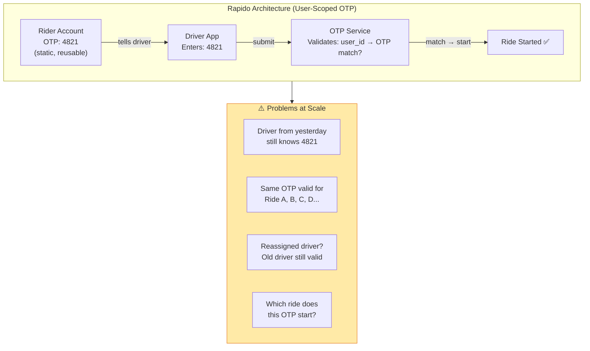

### 2.2 Uber: Ride-Scoped OTP (Full Architecture)

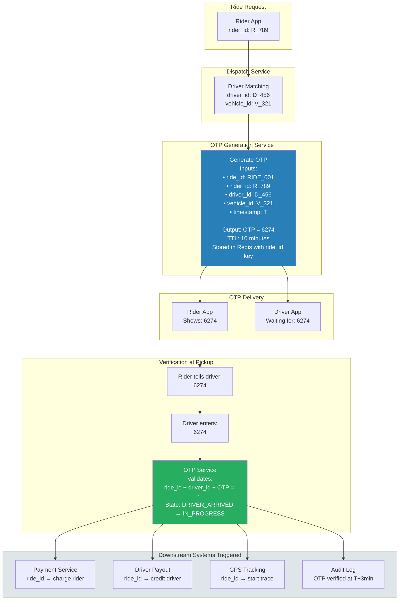

---

## 3. Layer 1 — State Transition and Ride Lifecycle

The OTP is not a verification code. It is a **state transition gate**.

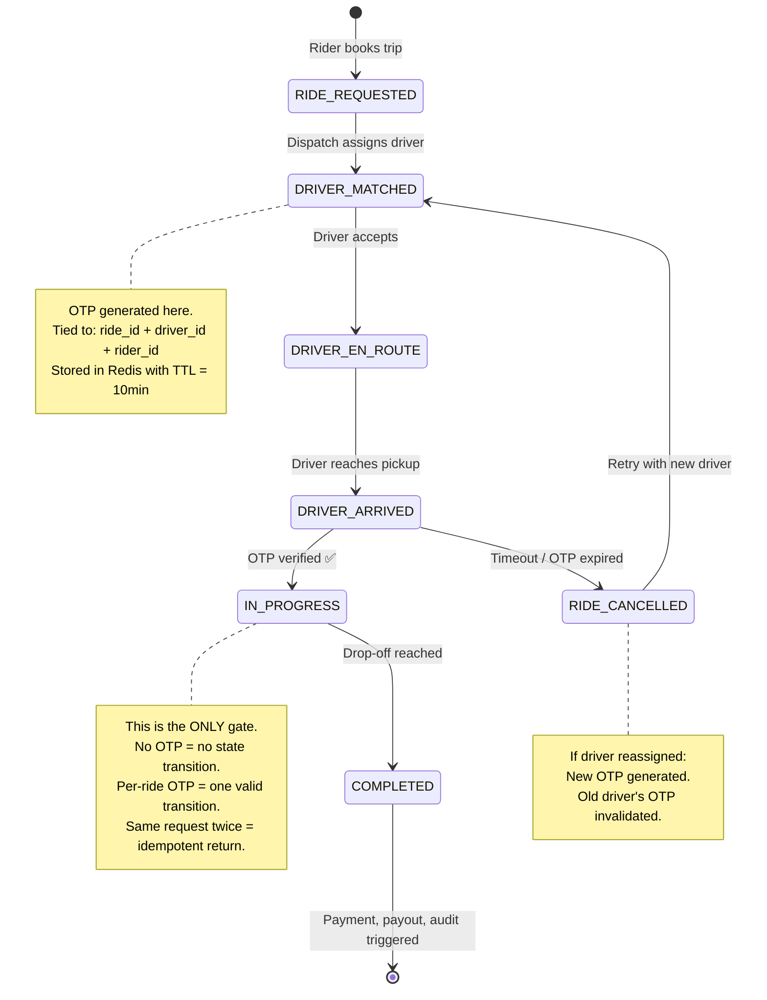

### The OTP as a State Transition Token

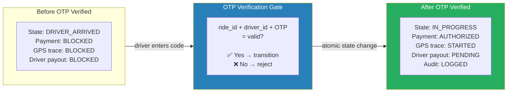

> **Why this matters:** The OTP is the only event that transitions a ride from `DRIVER_ARRIVED` to `IN_PROGRESS`. Every financial, safety, and tracking system downstream trusts this single gate. If that gate is ambiguous (reusable OTP = ambiguous), everything downstream inherits that ambiguity.

---

## 4. Layer 2 — Idempotency and Concurrency Correctness

This is the layer most candidates miss entirely.

### 4.1 The Concurrent Ride Problem

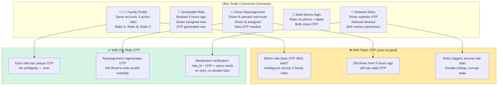

### 4.2 Idempotency: The Network Retry Problem

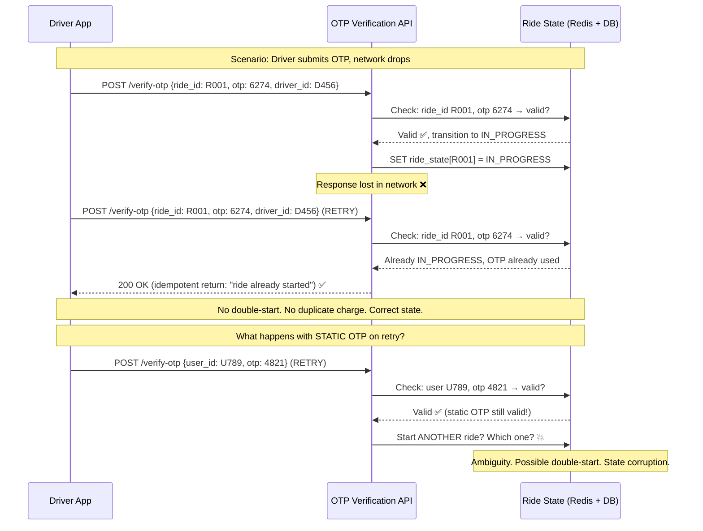

### 4.3 The Idempotency Key Formula

```
With per-ride OTP:
  idempotency_key = (ride_id, driver_id, rider_id, otp)
  → uniquely identifies one valid start event
  → same key submitted twice = safe no-op

With static OTP:
  idempotency_key = (user_id, otp)
  → could match multiple rides
  → retry could start the wrong ride
  → cannot be made safely idempotent
```

---

## 5. Layer 3 — Fraud, Replay Attacks, and Blast Radius

### 5.1 Attack Vectors That Static OTP Creates

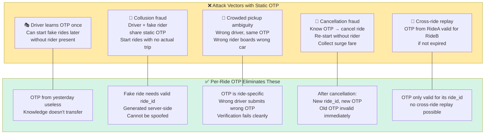

### 5.2 Blast Radius Comparison

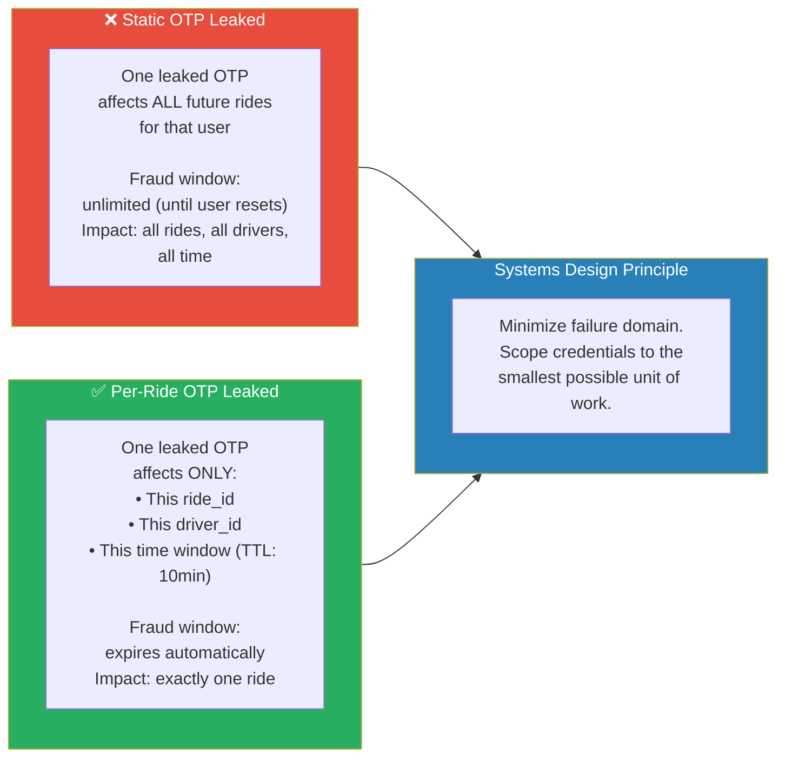

### 5.3 The Crowded Pickup Problem (Wrong-Trip Protection)

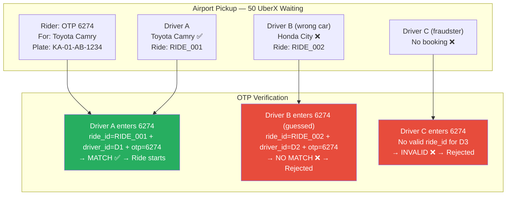

---

## 6. Layer 4 — Support, Reconciliation, and Audit Trail

This is the layer almost no candidate mentions. At Uber's scale, it is as important as fraud prevention.

### 6.1 The Clean Audit Trail Per-Ride OTP Creates

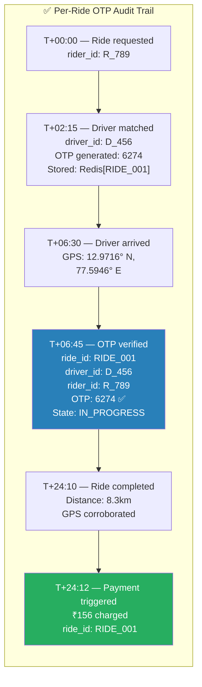

### 6.2 Support Resolution: Per-Ride OTP vs Static OTP

```mermaid
graph TD
    subgraph Complaint["Rider complaint: 'I was charged for a ride I didn't take'"]
        COMP["Support ticket opened"]
    end

    subgraph StaticSupport["❌ With Static OTP — Support Investigation"]
        SS1["Was the rider's OTP 4821 used?"]
        SS2["When? Multiple rides may match..."]
        SS3["Was the driver the right one?\nCan't verify — OTP is user-level"]
        SS4["GPS match? Maybe. Timestamp? Maybe."]
        SS5["Resolution: Gut feel + user report\nHigh ambiguity → expensive manual review"]
        SS1 --> SS2 --> SS3 --> SS4 --> SS5
    end

    subgraph PerRideSupport["✅ With Per-Ride OTP — Support Investigation"]
        PS1["ride_id from charge record"]
        PS2["OTP 6274 generated at T+02:15\nfor driver D_456, vehicle V_321"]
        PS3["OTP verified at T+06:45\nGPS: matches pickup location"]
        PS4["GPS corroborates: 8.3km trip completed"]
        PS5["Resolution: Definitive. Automated.\nUnambiguous evidence chain."]
        PS1 --> PS2 --> PS3 --> PS4 --> PS5
    end

    COMP --> StaticSupport
    COMP --> PerRideSupport

    style SS5 fill:#e74c3c,color:#fff
    style PS5 fill:#27ae60,color:#fff
```

> **At Uber's scale:** Even a 0.1% dispute rate at 20 million rides/day = 20,000 disputes/day. Ambiguous audit trails that require manual resolution at that volume cost tens of millions of dollars per year in support staffing.

---

## 7. Why Rapido's Approach Is a Valid Engineering Trade-off

Rapido's choice is not wrong — it is an intentional trade-off based on a different threat model.

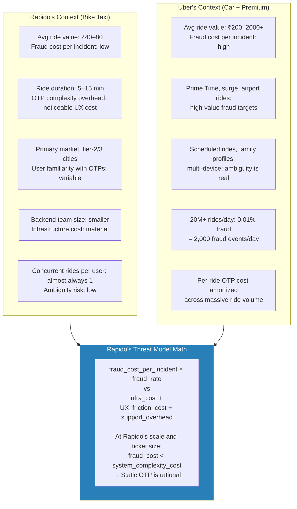

> **The engineering lesson:** There is no universally correct answer. The right design depends on threat model, scale, ticket size, and operational cost. Rapido's static OTP is not a mistake — it is a calibrated trade-off that makes sense at their scale and risk profile. Uber's per-ride OTP makes sense at their scale and risk profile.

---

## 8. The Backend Complexity Uber Accepts

Per-ride OTP is not free. Here is everything Uber's systems must handle that Rapido's don't.

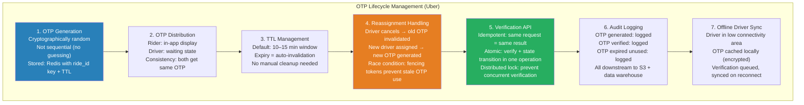

### The Redis Data Model

```
Key:   OTP:RIDE_001
Value: {
    otp:        "6274",
    ride_id:    "RIDE_001",
    rider_id:   "R_789",
    driver_id:  "D_456",
    vehicle_id: "V_321",
    status:     "PENDING",        ← changes to USED after verification
    generated:  1718000000,
    ttl:        600               ← 10 minutes in seconds
}
TTL: 600 seconds (auto-expiry)
```

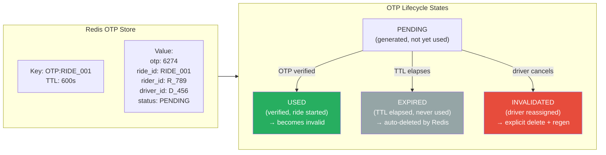

---

## 9. How Real Companies Apply This Pattern

### 9.1 Stripe — Payment Idempotency Keys

Stripe uses a structurally identical pattern for payments. Every charge has an `idempotency_key` that scopes the operation to a single transaction — not to the user.

- Prevents duplicate charges on network retry
- Same key submitted twice = deterministic same result
- Key expires after 24 hours (transaction-scoped TTL)
- Audit trail: every idempotency key is logged with request fingerprint

> This is per-transaction scoping, identical to Uber's per-ride OTP.

📎 [Stripe Idempotent Requests Documentation](https://stripe.com/docs/api/idempotent_requests)

---

### 9.2 AWS STS — Session Tokens (Not Permanent Credentials)

AWS IAM could give every user a permanent access key. Instead, AWS Security Token Service (STS) issues short-lived session tokens.

- Session token = scoped to a session (not the user account)
- TTL: 15 minutes to 36 hours
- Leaked token expires automatically — blast radius contained
- Every session generates unique credentials

> Same principle: credential scoped to the unit of work, not the identity.

📎 [AWS STS Session Token Documentation](https://docs.aws.amazon.com/STS/latest/APIReference/API_GetSessionToken.html)

---

### 9.3 Google — One-Time Authorization Codes (OAuth PKCE)

OAuth 2.0 authorization codes are single-use, short-TTL, and scoped to a specific authorization request. Reusing a code is a security error (RFC 6749 Section 4.1.2).

- Auth code expires in 10 minutes
- Auth code is single-use (invalidated after first exchange)
- Scoped to: client_id + redirect_uri + scope + state parameter
- Not reusable across different client sessions

> Same pattern: session-scoped, single-use, short TTL.

📎 [RFC 6749 — OAuth 2.0 Authorization Code](https://datatracker.ietf.org/doc/html/rfc6749#section-4.1)

---

### 9.4 Ola, Lyft, DiDi — Industry Convergence

All major ride-hailing platforms at scale converged on per-ride OTP (or equivalent):

| Company | Mechanism | Scope | Why |
|---------|-----------|-------|-----|
| **Uber** | Per-ride OTP with Redis TTL | ride_id | Fraud, idempotency, audit |
| **Lyft** | Per-ride PIN | ride_id | Same fraud/safety concerns |
| **Ola** | Per-ride OTP | ride_id | Adopted as market matured |
| **DiDi** | Per-ride verification code | trip_id | Safety mandate, fraud prevention |
| **Rapido** | Static user OTP | user_id | Simpler, valid at current scale |

> Industry convergence is itself a signal: as platforms scale and fraud cost grows, the per-ride scoped model wins.

---

### 9.5 Banking — OTP TTL Best Practices (RBI Guidelines)

The Reserve Bank of India mandates that OTPs for financial transactions:
- Must expire within 30 minutes
- Must be single-use
- Must be transaction-scoped (not session-reusable)

Uber's ride = a financial transaction. The same regulatory logic applies.

📎 [RBI Guidelines on OTP-based Authentication](https://rbi.org.in/scripts/NotificationUser.aspx?Id=11522&Mode=0)

---

## 10. Bottlenecks Resolved: Summary Matrix

| # | Problem | With Static OTP | With Per-Ride OTP | Pattern Used |
|---|---------|----------------|-------------------|--------------|
| 1 | **Wrong-trip boarding** | Wrong driver can use leaked OTP | OTP tied to driver_id — wrong driver rejected | Scope minimization |
| 2 | **Driver reassignment safety** | Old driver retains valid OTP | Reassignment invalidates old OTP, generates new | Credential revocation |
| 3 | **Concurrent rides (family profile)** | OTP is ambiguous across rides | Each ride has unique OTP, no ambiguity | Session isolation |
| 4 | **Network retry → double ride start** | Retry re-validates same OTP, second start possible | Idempotent: ride_id + OTP = one result always | Idempotent state machine |
| 5 | **Replay attack from past rides** | OTP from past ride still valid | OTP expired (TTL 10min), unusable after ride | TTL-based expiry |
| 6 | **Cross-ride fraud (driver collusion)** | Fake rides using known static OTP | ride_id generated server-side, cannot be spoofed | Server-side token generation |
| 7 | **Blast radius on OTP leak** | All future rides compromised | Only one ride affected, expires automatically | Blast radius minimization |
| 8 | **Support reconciliation** | Ambiguous: which ride, which driver? | Clean audit: OTP → ride_id → driver → GPS → payment | Immutable audit trail |
| 9 | **Fraud analytics** | OTP reuse undetectable | OTP reuse = impossible; anomaly detection clean | Deterministic uniqueness |
| 10 | **Regulatory / financial compliance** | OTP reuse violates transaction-scoped norms | Compliant with transaction-scoped OTP standards | Regulatory alignment |

---

## 11. Closing Statement

> *For the Uber interviewer — the complete answer:*

**"The core difference is what the OTP proves. Rapido's OTP proves 'this is the customer.' Uber's OTP proves 'this exact rider is entering this exact vehicle for this exact trip right now.'**

**Uber scopes the OTP to the ride because the ride is the unit of risk — it is a financial transaction, a safety event, a driver payout, a fraud boundary, and a support reconciliation record all at once.**

**A per-ride OTP solves four concrete engineering problems that a static OTP cannot:**

**First, idempotency. Starting a ride is a state transition from DRIVER_ARRIVED to IN_PROGRESS. A per-ride OTP makes this cleanly idempotent — the same OTP submitted twice safely returns the same result, preventing double-starts on network retry.**

**Second, concurrency correctness. Uber handles family profiles, scheduled rides, multi-device logins, and driver reassignments simultaneously. A user-scoped OTP is ambiguous across concurrent rides. A ride-scoped OTP is unambiguous by construction.**

**Third, fraud containment. A static OTP creates cross-ride replay risk, wrong-trip boarding, and driver collusion vectors. A per-ride OTP expires in 10 minutes, is tied to a specific driver_id, and becomes useless the moment the ride ends or the driver is reassigned. Blast radius is exactly one ride.**

**Fourth, support and reconciliation. At 20 million rides per day, even a 0.1% dispute rate is 20,000 cases daily. Per-ride OTPs create an unambiguous audit chain — OTP generated, driver arrived, rider verified, GPS matched, payment triggered — that resolves disputes programmatically rather than manually.**

**Rapido's approach is a rational trade-off. At their scale and ticket size, the engineering cost of per-ride OTP infrastructure exceeds the fraud cost it would prevent. As they scale, they will likely converge on the same model — every major ride-hailing platform at scale has.**

**The deeper systems principle is: credentials should have narrow scope and short lifetime, and they should be scoped to the unit of work, not the identity of the user. The same principle governs AWS session tokens, Stripe idempotency keys, and OAuth authorization codes."**

---

*References:*
- [Stripe Idempotent Requests](https://stripe.com/docs/api/idempotent_requests)
- [AWS STS GetSessionToken](https://docs.aws.amazon.com/STS/latest/APIReference/API_GetSessionToken.html)
- [RFC 6749 — OAuth 2.0 Authorization Code Flow](https://datatracker.ietf.org/doc/html/rfc6749#section-4.1)
- [RBI OTP Guidelines for Financial Transactions](https://rbi.org.in/scripts/NotificationUser.aspx?Id=11522&Mode=0)
- [Google SRE Book — Designing for Failure](https://sre.google/sre-book/introduction/)
- [AWS Builders Library — Making Retries Safe with Idempotency](https://aws.amazon.com/builders-library/making-retries-safe-with-idempotent-APIs/)
- [Martin Kleppmann — Designing Data-Intensive Applications, Chapter 9 (Consistency & Consensus)](https://dataintensive.net/)
